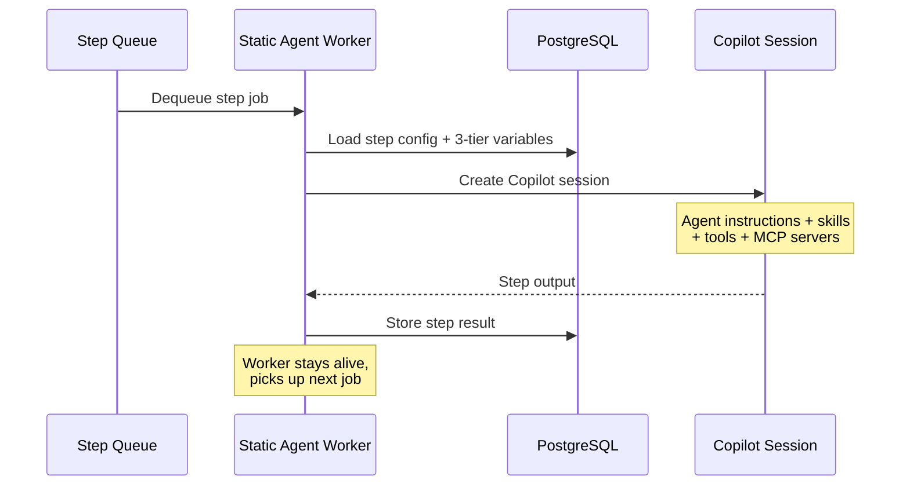
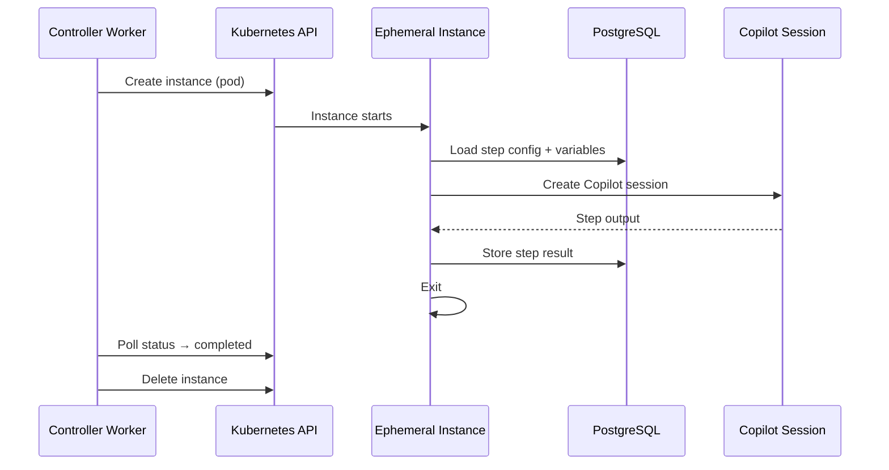

# Agent Instances

Following a **Jenkins Controller + Agent** pattern, workflow steps are executed by **Agent Instances**. Static workers and ephemeral pods run simultaneously — there is no mode switch.

For the system-wide architecture and component diagram, see [System Overview](/architecture/overview).

## Static Instances (Docker / VM / K8s)

Pre-provisioned, long-running worker processes. Each static instance connects to a BullMQ queue (`agent-step-execution`) and picks up step execution jobs. Works in **any environment** — Docker Compose, VM, or Kubernetes.

- Registered in the `agent_instances` database table on startup
- Send periodic heartbeats (15s interval); marked offline if stale (60s threshold)
- Scale horizontally by running more worker containers/processes
- Managed via the Instances page in the UI



## Ephemeral Instances (Kubernetes only)

Short-lived instances created on-demand per workflow step. The controller creates a K8s pod, the pod executes one step, writes results, and exits:

- Requires Kubernetes with RBAC for pod management
- Provides strong workload isolation (each step = separate container)
- Max concurrent instances controlled via Redis semaphore (`MAX_CONCURRENT_AGENTS`)
- Pods are auto-cleaned after completion



## Communication & Ports

Agent instances (both static and ephemeral) **do not expose any inbound network ports**. All communication uses outbound connections to shared infrastructure:

| Channel | Protocol | Direction | Purpose |
|---|---|---|---|
| **BullMQ (Redis)** | Redis `:6379` | Outbound | Receive step jobs from the `agent-step-execution` queue |
| **PostgreSQL** | TCP `:5432` | Outbound | Read step config, write execution results, heartbeat updates |
| **GitHub Copilot API** | HTTPS `:443` | Outbound | Create Copilot sessions, send prompts, receive responses |
| **MCP Servers** | stdio (child process) | Local | Spawn MCP servers as subprocesses within the same container |

**Status polling** does not use HTTP health endpoints. Instead:

| Instance Type | Status Mechanism |
|---|---|
| **Static Worker** | Writes `lastHeartbeatAt` to `agent_instances` table every 15s. Marked offline if stale (>60s). The API reads this table for the Instances UI page. |
| **Ephemeral Instance** | Controller polls the Kubernetes API (`GET /api/v1/namespaces/.../pods/{name}`) to check pod phase (`Running` → `Succeeded` / `Failed`). Pods are deleted after results are written. |

> **Firewall note:** Agent instances only need **outbound** access to PostgreSQL, Redis, and `api.githubcopilot.com`. No inbound ports need to be opened.

## Scaling Strategy

| Component | Scaling Approach | Notes |
|---|---|---|
| **Controller (Poller)** | Leader election — 1 active + N standby | Only one instance polls; extras provide automatic failover |
| **Controller (Worker)** | BullMQ concurrency per instance | Each instance processes 1 job at a time; add instances for throughput |
| **Static Agent Workers** | Horizontal scaling | Add more worker containers; each listens on the same BullMQ queue |
| **Ephemeral Instances** | Dynamic provisioning + semaphore | Max concurrent agents configurable via `MAX_CONCURRENT_AGENTS` (default: 10) |
| **OAO-API** | Horizontal scaling (HPA) | Stateless HTTP handlers; scale freely behind a load balancer |
| **OAO-UI** | Horizontal scaling (HPA) | Stateless Nuxt SSR; scale freely |

## Docker Images

OAO ships as **two Docker images**:

| Image | Contents | Roles |
|---|---|---|
| `oao-core` | Node.js backend (shared + oao-api packages) | API, Controller, Agent Worker — selected by CMD at runtime |
| `oao-ui` | Nuxt 3 SSR frontend | UI only |

To select the role at runtime, override the container command:

```bash
# API (default CMD)
node --import tsx packages/oao-api/src/server.ts

# Controller
node --import tsx packages/oao-api/src/workers/controller.ts

# Static Agent Worker
node --import tsx packages/oao-api/src/workers/agent-worker.ts
```
