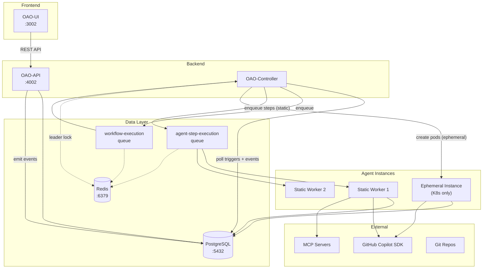
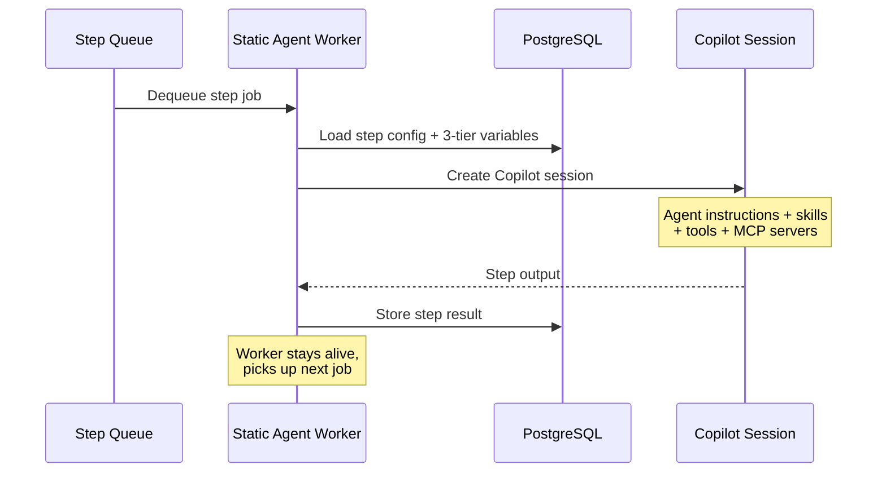
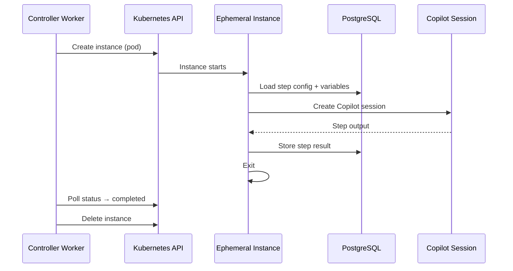
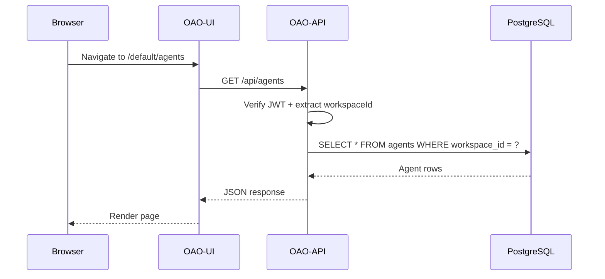
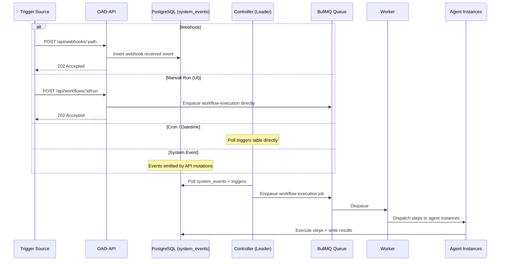

# System Overview

Open Agent Orchestra (OAO) is an autonomous AI workflow engine. It can be deployed on Docker, Kubernetes, or a standalone VM — the architecture is runtime-agnostic.

## Components & Ports

| Component | Role | Default Port | Scalable |
|---|---|---|---|
| **OAO-API** | Stateless REST API serving all client requests | 4002 | Yes (horizontal) |
| **OAO-UI** | Dashboard (Nuxt 3 SSR) for managing the platform | 3002 | Yes (horizontal) |
| **OAO-Controller** | Trigger poller + workflow dispatcher (leader-elected) | — | Yes (HA standby) |
| **Static Agent Worker** | Long-running BullMQ consumer for step execution | — | Yes (horizontal) |
| **Ephemeral Agent Instance** | Short-lived K8s pod per step (K8s only) | — | Auto (per-step) |
| **PostgreSQL** | Persistent storage + pgvector embeddings | 5432 | External / managed |
| **Redis** | Job queues (BullMQ) + leader lock + semaphore | 6379 | External / managed |

All backend services (API, Controller, Agent Worker) run from a **single Docker image** (`oao-core`). The role is selected by the container's entrypoint command — no separate build is needed for each component.

## Design Principles

**Why separate components?**

| Principle | How OAO applies it |
|---|---|
| **Scalability** | API scales independently from the Controller and Agent Workers. Stateless API pods can be auto-scaled based on request load, while agent workers scale based on queue depth. |
| **Resilience** | If an agent worker crashes mid-step, the Controller detects the failure and marks the step as failed — other workers and the API are unaffected. Leader election ensures the Controller has automatic failover. |
| **Static vs Dynamic Workload** | API/UI traffic is predictable (human-driven). Agent workload is bursty (batch workflows, cron triggers). Separating them prevents AI workloads from starving HTTP responses. |
| **Security Isolation** | Only the Controller needs Kubernetes RBAC (for ephemeral pods). Agent workers only need database + Redis + GitHub token access. The API never executes AI sessions directly. |
| **Single Image, Multiple Roles** | One `oao-core` image reduces build time, avoids image drift, and simplifies registry management. Runtime command selects the process. |

## High-Level Architecture



All trigger types — cron, datetime, webhook, and event — flow through the Controller via `system_events`. Manual Run (`POST /api/workflows/:id/run`) bypasses the event system and enqueues execution directly.

## Network & IP Ranges

| Component | Network Access | IP Range |
|---|---|---|
| OAO-API | Accepts inbound HTTP on `:4002`. Connects to PostgreSQL, Redis. | Cluster IP (fixed Service) |
| OAO-UI | Accepts inbound HTTP on `:3002`. Proxies `/api/*` to OAO-API. | Cluster IP (fixed Service) |
| OAO-Controller | No inbound ports. Connects to PostgreSQL, Redis, Kubernetes API (ephemeral mode). | Pod IP (no Service) |
| Static Agent Worker | No inbound ports. Connects to PostgreSQL, Redis, GitHub Copilot API, MCP servers. | Pod IP (no Service) |
| Ephemeral Instance | No inbound ports. Created dynamically in the same namespace. Connects to PostgreSQL, Redis, GitHub Copilot API, MCP servers. | **Dynamic Pod IPs** — allocated from the cluster pod CIDR (typically `10.244.0.0/16`). Each instance gets a unique IP that is released on termination. |
| PostgreSQL | Accepts connections on `:5432` from API, Controller, all agent instances. | Headless Service (`postgres`) |
| Redis | Accepts connections on `:6379` from API, Controller, all agent instances. | Cluster IP Service (`redis`) |

> **Note:** Ephemeral instances are short-lived pods with no stable IP. They resolve backend services via Kubernetes DNS (`postgres.open-agent-orchestra.svc`, `redis.open-agent-orchestra.svc`). The Controller must have RBAC permission to create/delete pods in the namespace.

## Components

### OAO-API

The stateless REST API serving all client requests:

- **Authentication** — JWT (HS256, 7-day expiry) with workspace context
- **Routes** — Agents, Workflows, Triggers, Executions, Variables, Instances, Admin, Events, Webhooks, Tokens
- **Validation** — Zod schemas on all inputs
- **Security** — AES-256-GCM encryption for credentials, HMAC-SHA256 webhooks, PAT with fine-grained scopes
- **Event emission** — All mutations emit `system_events` for audit and trigger matching

### OAO-UI

The dashboard for managing the platform:

- Agent configuration, workflow design, execution monitoring
- Agent instance monitoring (Static + Ephemeral)
- Variable management, plugin management, admin controls
- JWT auth with middleware guards; all `/api/*` proxied to OAO-API

### OAO-Controller

A long-running process that manages triggers and dispatches work. Runs as a container (Docker/K8s) or a standalone process:

| Sub-component | Role |
|---|---|
| **Leader Election** | Redis `SETNX` with 60s TTL — only one instance polls; others are standby |
| **Trigger Poller** | Polls PostgreSQL for due triggers and new `system_events` |
| **BullMQ Worker** | Dequeues workflow jobs. Dispatches steps to static workers (via queue) or ephemeral instances (via K8s API). |

**Scaling:** Deploy multiple controller replicas for HA. Leader election ensures exactly one polls. BullMQ's atomic dequeue prevents duplicates.

### Agent Instances (Jenkins-Like Pattern)

Following a **Jenkins Controller + Agent** pattern, workflow steps are executed by **Agent Instances**. Static workers and ephemeral pods run simultaneously — there is no mode switch.

#### Static Instances (Docker / VM / K8s)

Pre-provisioned, long-running worker processes. Each static instance connects to a BullMQ queue (`agent-step-execution`) and picks up step execution jobs. Works in **any environment** — Docker Compose, VM, or Kubernetes.

- Registered in the `agent_instances` database table on startup
- Send periodic heartbeats (15s interval); marked offline if stale (60s threshold)
- Scale horizontally by running more worker containers/processes
- Managed via the Instances page in the UI



#### Ephemeral Instances (Kubernetes only)

Short-lived instances created on-demand per workflow step. The controller creates a K8s pod, the pod executes one step, writes results, and exits:

- Requires Kubernetes with RBAC for pod management
- Provides strong workload isolation (each step = separate container)
- Max concurrent instances controlled via Redis semaphore (`MAX_CONCURRENT_AGENTS`)
- Pods are auto-cleaned after completion



### Scaling Strategy

| Component | Scaling Approach | Notes |
|---|---|---|
| **Controller (Poller)** | Leader election — 1 active + N standby | Only one instance polls; extras provide automatic failover |
| **Controller (Worker)** | BullMQ concurrency per instance | Each instance processes 1 job at a time; add instances for throughput |
| **Static Agent Workers** | Horizontal scaling | Add more worker containers; each listens on the same BullMQ queue |
| **Ephemeral Instances** | Dynamic provisioning + semaphore | Max concurrent agents configurable via `MAX_CONCURRENT_AGENTS` (default: 10) |
| **OAO-API** | Horizontal scaling (HPA) | Stateless HTTP handlers; scale freely behind a load balancer |
| **OAO-UI** | Horizontal scaling (HPA) | Stateless Nuxt SSR; scale freely |

### Docker Images

OAO ships as **two Docker images**:

| Image | Contents | Roles |
|---|---|---|
| `oao-core` | Node.js backend (shared + oao-api packages) | API, Controller, Agent Worker — selected by CMD at runtime |
| `oao-ui` | Nuxt 3 SSR frontend | UI only |

To select the role at runtime, override the container command:

```bash
# API (default CMD)
node --import tsx packages/oao-api/src/server.ts

# Controller
node --import tsx packages/oao-api/src/workers/controller.ts

# Static Agent Worker
node --import tsx packages/oao-api/src/workers/agent-worker.ts
```

## Request Flow



## Trigger Flow (Unified Event-Based)

Automated trigger types follow the same pattern — the API writes a `system_event`, and the Controller picks it up. Manual Run bypasses the event system:



## URL Routing

All UI routes are workspace-scoped: `/{workspace-slug}/{page}`

| Route | Purpose |
|---|---|
| `/{ws}/` | Dashboard |
| `/{ws}/agents` | Agent management |
| `/{ws}/workflows` | Workflow management |
| `/{ws}/executions` | Execution history |
| `/{ws}/instances` | Agent instance monitoring |
| `/{ws}/events` | System event viewer |
| `/{ws}/variables` | Variable management |
| `/{ws}/plugins` | Plugin management |
| `/{ws}/admin/users` | User administration |
| `/{ws}/admin/models` | Model registry |
| `/{ws}/admin/quotas` | Quota settings |
| `/{ws}/workspaces` | Workspace management (super_admin) |
| `/{ws}/settings/tokens` | Personal Access Tokens |
