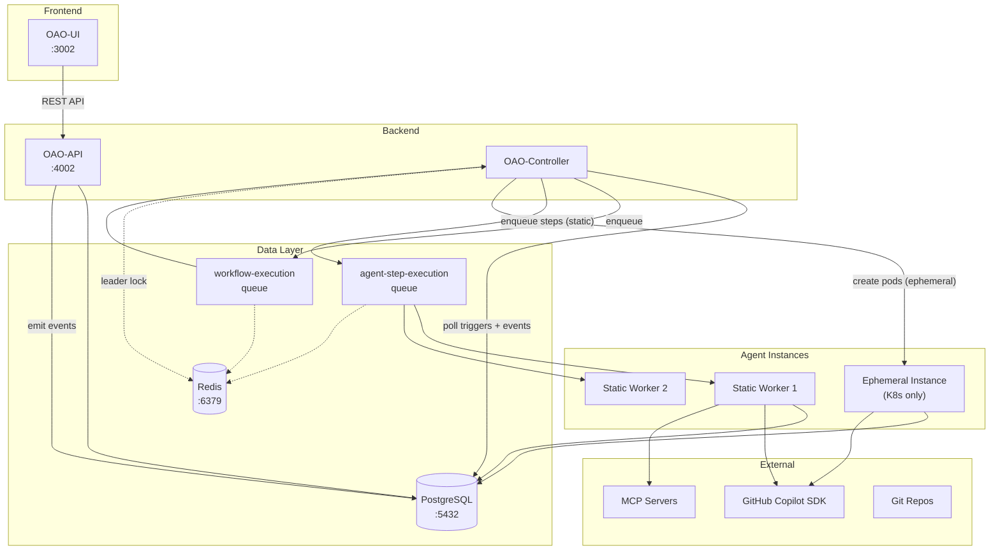

# System Overview

Open Agent Orchestra (OAO) is an autonomous AI workflow engine. It can be deployed on Docker, Kubernetes, or a standalone VM — the architecture is runtime-agnostic.

## Components & Ports

| Component | Role | Default Port | Scalable |
|---|---|---|---|
| **OAO-API** | Stateless REST API serving all client requests | 4002 | Yes (horizontal) |
| **OAO-UI** | Dashboard (Nuxt 3 SSR) for managing the platform | 3002 | Yes (horizontal) |
| **OAO-Controller** | Trigger poller + workflow dispatcher (leader-elected) | — | Yes (HA standby) |
| **Static Agent Worker** | Long-running BullMQ consumer for step execution | — | Yes (horizontal) |
| **Ephemeral Agent Instance** | Short-lived K8s pod per step (K8s only) | — | Auto (per-step) |
| **PostgreSQL** | Persistent storage + pgvector embeddings | 5432 | External / managed |
| **Redis** | Job queues (BullMQ) + leader lock + semaphore | 6379 | External / managed |

All backend services (API, Controller, Agent Worker) run from a **single Docker image** (`oao-core`). The role is selected by the container's entrypoint command — no separate build is needed for each component.

## Design Principles

**Why separate components?**

| Principle | How OAO applies it |
|---|---|
| **Scalability** | API scales independently from the Controller and Agent Workers. Stateless API pods can be auto-scaled based on request load, while agent workers scale based on queue depth. |
| **Resilience** | If an agent worker crashes mid-step, the Controller detects the failure and marks the step as failed — other workers and the API are unaffected. Leader election ensures the Controller has automatic failover. |
| **Static vs Dynamic Workload** | API/UI traffic is predictable (human-driven). Agent workload is bursty (batch workflows, cron triggers). Separating them prevents AI workloads from starving HTTP responses. |
| **Security Isolation** | Only the Controller needs Kubernetes RBAC (for ephemeral pods). Agent workers only need database + Redis + GitHub token access. The API never executes AI sessions directly. |
| **Single Image, Multiple Roles** | One `oao-core` image reduces build time, avoids image drift, and simplifies registry management. Runtime command selects the process. |

## High-Level Architecture

All trigger types — cron, datetime, webhook, event, and Manual Run — flow through the Controller via `system_events`.

## Components

### OAO-API

The stateless REST API serving all client requests:

- **Authentication** — JWT (HS256, 7-day expiry) with workspace context
- **Routes** — Agents, Workflows, Triggers, Executions, Variables, Instances, Admin, Events, Webhooks, Tokens
- **Validation** — Zod schemas on all inputs
- **Security** — AES-256-GCM encryption for credentials, HMAC-SHA256 webhooks, PAT with fine-grained scopes
- **Event emission** — All mutations emit `system_events` for audit and trigger matching

### OAO-UI

The dashboard for managing the platform:

- Agent configuration, workflow design, execution monitoring
- Agent instance monitoring (Static + Ephemeral)
- Variable management, plugin management, admin controls
- JWT auth with middleware guards; all `/api/*` proxied to OAO-API

### OAO-Controller

A long-running process that manages triggers and dispatches work. Runs as a container (Docker/K8s) or a standalone process:

| Sub-component | Role |
|---|---|
| **Leader Election** | Redis `SETNX` with 60s TTL — only one instance polls; others are standby |
| **Trigger Poller** | Polls PostgreSQL for due triggers and new `system_events` |
| **BullMQ Worker** | Dequeues workflow jobs. Dispatches steps to static workers (via queue) or ephemeral instances (via K8s API). |

**Scaling:** Deploy multiple controller replicas for HA. Leader election ensures exactly one polls. BullMQ's atomic dequeue prevents duplicates.

For more details on agent instances (static vs ephemeral), scaling strategy, and Docker image roles, see [Agent Instances](/architecture/agent-instances).

For request and trigger flow diagrams, see [Request & Trigger Flows](/architecture/request-flows).
