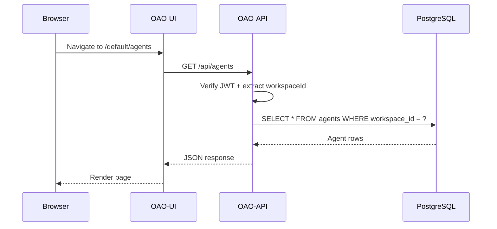
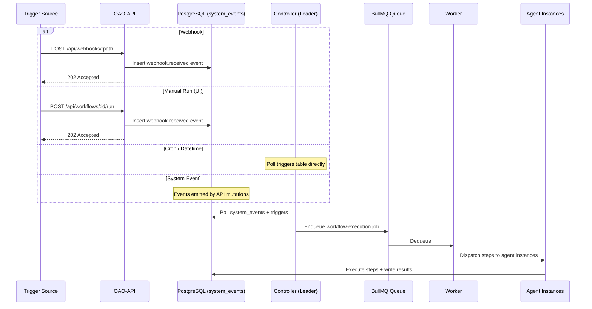

# Request & Trigger Flows

How data flows through the OAO platform for user requests and automated triggers. For the component overview, see [System Overview](/architecture/overview).

## Request Flow

## Trigger Flow (Unified Event-Based)

All trigger types follow the same event-based pattern — the API writes a `system_event`, and the Controller picks it up:

## URL Routing

All UI routes are workspace-scoped: `/{workspace-slug}/{page}`

| Route | Purpose |
|---|---|
| `/{ws}/` | Dashboard |
| `/{ws}/agents` | Agent management |
| `/{ws}/workflows` | Workflow management |
| `/{ws}/executions` | Execution history |
| `/{ws}/instances` | Agent instance monitoring |
| `/{ws}/events` | System event viewer |
| `/{ws}/variables` | Variable management |
| `/{ws}/admin/users` | User administration |
| `/{ws}/admin/models` | Model registry |
| `/{ws}/admin/rate-limits` | Rate limit settings |
| `/{ws}/workspaces` | Workspace management (super_admin) |
| `/{ws}/settings/tokens` | Personal Access Tokens |
