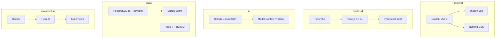

# Technologies

The full technology stack used by Open Agent Orchestra (OAO).

## Stack Overview

## Detailed Stack

| Layer | Technology | Version | Purpose |
|---|---|---|---|
| **Runtime** | Node.js | >= 24 | Server runtime |
| **Language** | TypeScript | strict mode | Type safety across all packages |
| **API Framework** | Hono | v4.6 | Fast, lightweight REST API with `@hono/node-server` |
| **Frontend** | Nuxt 3 / Vue 3 | 3.x | SSR dashboard application |
| **UI Components** | shadcn-vue | Latest | Reusable Vue component library |
| **Styling** | Tailwind CSS | Latest | Utility-first CSS framework |
| **Database** | PostgreSQL | 16 | Primary data store |
| **Vector DB** | pgvector | — | Vector embeddings for agent memory |
| **ORM** | Drizzle ORM | Latest | Type-safe SQL query builder |
| **Queue / Cache** | Redis + BullMQ | 7 | Job queue and caching |
| **AI SDK** | GitHub Copilot SDK | Latest | Copilot session management, tool definitions |
| **Auth** | JWT (jose, HS256) | — | 7-day expiry tokens with workspace context |
| **Encryption** | AES-256-GCM | — | Credential encryption at rest |
| **Validation** | Zod | Latest | Runtime schema validation on API boundaries |
| **Testing** | Vitest | Latest | Unit and integration testing |
| **Linting** | ESLint (flat config) | Latest | Code quality |
| **Formatting** | Prettier | Latest | Code formatting |
| **Containers** | Docker | Latest | Image building |
| **Orchestration** | Kubernetes | Docker Desktop K8s | Container orchestration |
| **Package Manager** | Helm | >= 3 | Kubernetes deployment management |

## Key Design Decisions

### Why Hono?

- Lightweight (< 14 KB) with excellent TypeScript support
- Web Standards API compatible
- Fast routing with zero dependencies
- Built-in middleware pattern matching the project's needs

### Why Drizzle ORM?

- Type-safe SQL without heavy abstraction
- Schema defined in TypeScript code
- Simple migration via `drizzle-kit push`
- Excellent PostgreSQL support including pgvector

### Why BullMQ?

- Battle-tested job queue on Redis
- Built-in retry, concurrency control, and rate limiting
- Dashboard available for monitoring
- Low overhead for the workflow execution pattern

### Why GitHub Copilot SDK?

- Direct integration with GitHub Copilot models
- `defineTool()` for structured tool definitions with Zod schemas
- Session management with permission handling
- Model flexibility (GPT, Claude, etc.)

### Why Helm + Kubernetes?

- Declarative infrastructure as code
- Easy rollback and versioning
- Service discovery and health checks
- Horizontal scaling via replica configuration
