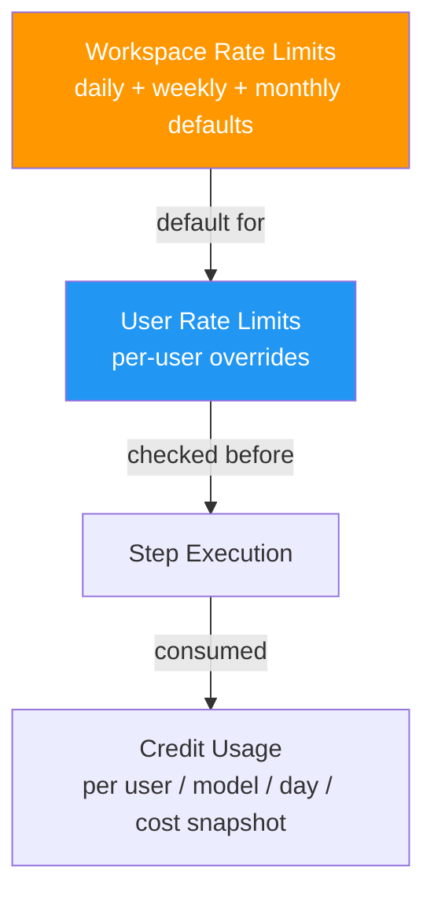
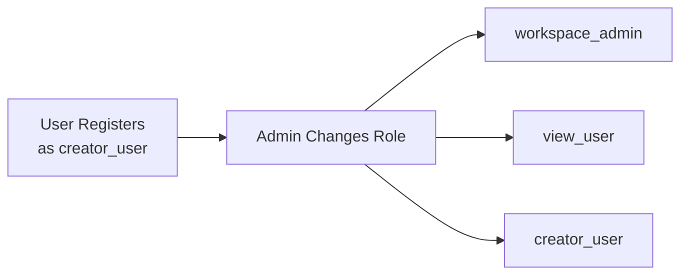

# Admin

Workspace administrators have access to management features for models, users, rate limits, and security.

## Admin Pages

| Page | Path | Description |
|------|------|-------------|
| Users | `/{workspace}/admin/users` | List, add, and manage user roles |
| Models | `/{workspace}/admin/models` | Configure available AI models and credit costs |
| Auth Providers | `/{workspace}/admin/auth-providers` | Configure authentication providers (Database, LDAP). See [Auth Providers](/concepts/auth-providers) |
| Rate Limits | `/{workspace}/admin/rate-limits` | Set workspace defaults and per-user credit limits |
| Security | `/{workspace}/admin/security` | Configure workspace self-service registration and forgot-password access |
| Mail Settings | `/{workspace}/admin/mail-settings` | Configure global SMTP settings for password reset and system emails (`super_admin` only) |
| Workspaces | `/{workspace}/workspaces` | Manage workspaces (`super_admin` only) |

## Model Management

Admins configure which AI models are available in the workspace. Each model has:

| Field | Description |
|---|---|
| **Name** | Model identifier (e.g., `gpt-5.4`, `claude-sonnet-4-6`) |
| **Provider** | Provider name (default: `github`) |
| **Credit Cost** | Credits consumed per session (default: 1.00) |
| **Active** | Whether the model is available for use |

Active model records power the authenticated model selectors used by conversations and other runtime configuration screens. If a model is deactivated or removed, turn settings fall back to the current workspace default instead of continuing to show a phantom hard-coded model name.

Default models created by the seed script:

| Model | Provider | Credit Cost |
|---|---|---|
| `claude-sonnet-4-6` | Anthropic | 1.00 |
| `claude-opus-4-6` | Anthropic | 1.00 |
| `gpt-5.4` | OpenAI | 1.00 |
| `gpt-5-mini` | OpenAI | 1.00 |

## Rate Limit System

- **Workspace defaults** — Daily, weekly, and monthly credit limits for users who do not override them
- **User overrides** — Per-user limits that take precedence over workspace defaults
- **Credit tracking** — Tracked in `credit_usage` with the model credit cost snapshot captured at execution time
- **Historical stability** — Updating a model's current credit cost does not retroactively change prior usage totals

## User Management

- New users register as `creator_user` by default
- Admins can promote/demote users via **Admin → Users**
- `super_admin` can move users between workspaces

## Workspace Security

The **Admin → Security** page controls self-service account features at the workspace boundary:

| Setting | Effect |
|---|---|
| Allow User Registration | Shows the registration link on the login page and allows `POST /api/auth/register` for the workspace |
| Allow Forgot Password | Shows the forgot-password link for database users and allows password reset email requests |

Both settings are stored on the workspace record. Existing authenticated users can still sign in when registration is disabled, and LDAP users continue to manage passwords through their external directory.

## Mail Settings

The **Admin → Mail Settings** page is available to `super_admin` users and stores the platform SMTP configuration. Forgot-password email delivery uses this configuration; if SMTP is not configured, reset requests are accepted but no email is sent.

## System Events

The platform logs 21 system event types accessible via **Events** page:

| Category | Events |
|---|---|
| Agent | `agent.created`, `agent.updated`, `agent.deleted`, `agent.status_changed` |
| Workflow | `workflow.created`, `workflow.updated`, `workflow.deleted` |
| Execution | `execution.started`, `execution.completed`, `execution.failed`, `execution.cancelled` |
| Step | `step.completed`, `step.failed` |
| Trigger | `trigger.fired` |
| User | `user.login`, `user.registered` |
| Variable | `variable.created`, `variable.updated`, `variable.deleted` |

Events can be used to trigger workflows via [event triggers](/concepts/workflows#event-trigger).

## Supervisor Controls

Emergency controls for administrators:

| Endpoint | Description |
|---|---|
| `POST /api/supervisor/emergency-stop` | Pause all active agents |
| `POST /api/supervisor/resume-all` | Resume all paused agents |
| `GET /api/supervisor/status` | System-wide supervisor status |
