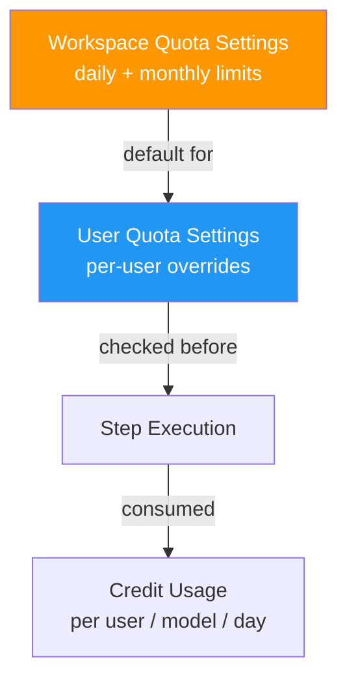
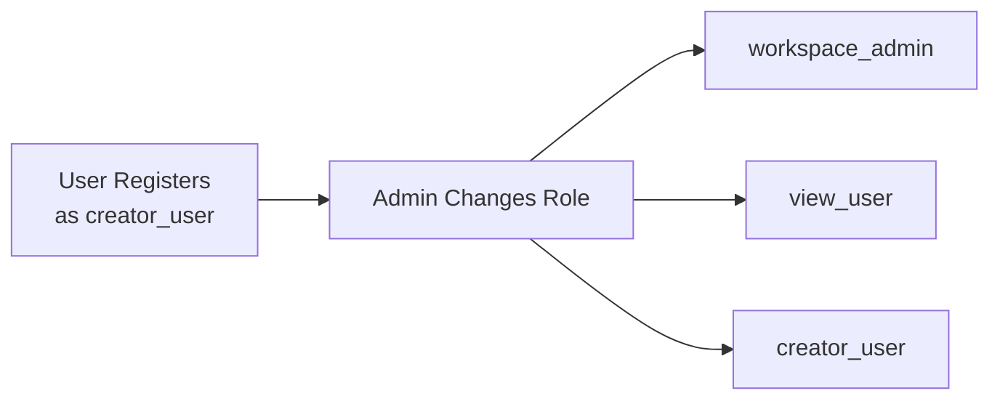

# Admin

Workspace administrators have access to management features for models, users, quotas, and plugins.

## Admin Pages

| Page | Path | Description |
|------|------|-------------|
| Users | `/{workspace}/admin/users` | List, add, and manage user roles |
| Models | `/{workspace}/admin/models` | Configure available AI models and credit costs |
| Quotas | `/{workspace}/admin/quotas` | Set workspace and per-user credit limits |
| Plugins | `/{workspace}/plugins` | Register and manage plugin repositories |
| Security | `/{workspace}/admin/security` | Configure credential approval and view access logs. See [AI Security](/concepts/security) |
| Workspaces | `/{workspace}/workspaces` | Manage workspaces (`super_admin` only) |

## Model Management

Admins configure which AI models are available in the workspace. Each model has:

| Field | Description |
|---|---|
| **Name** | Model identifier (e.g., `gpt-5.4`, `claude-sonnet-4-6`) |
| **Provider** | Provider name (default: `github`) |
| **Credit Cost** | Credits consumed per session (default: 1.00) |
| **Active** | Whether the model is available for use |

Default models created by the seed script:

| Model | Provider | Credit Cost |
|---|---|---|
| `claude-sonnet-4-6` | Anthropic | 1.00 |
| `claude-opus-4-6` | Anthropic | 1.00 |
| `gpt-5.4` | OpenAI | 1.00 |
| `gpt-5-mini` | OpenAI | 1.00 |

## Quota System

- **Workspace limits** — Default daily/monthly credit limits for all users
- **User overrides** — Per-user limits (must be ≤ workspace limits)
- **Credit tracking** — Tracked per user, per model, per day in `credit_usage` table
- **Enforcement** — Checked before each step execution; exceeded → step fails, execution halted

## User Management

- New users register as `creator_user` by default
- Admins can promote/demote users via **Admin → Users**
- `super_admin` can move users between workspaces

## System Events

The platform logs 21 system event types accessible via **Events** page:

| Category | Events |
|---|---|
| Agent | `agent.created`, `agent.updated`, `agent.deleted`, `agent.status_changed` |
| Workflow | `workflow.created`, `workflow.updated`, `workflow.deleted` |
| Execution | `execution.started`, `execution.completed`, `execution.failed`, `execution.cancelled` |
| Step | `step.completed`, `step.failed` |
| Trigger | `trigger.fired` |
| User | `user.login`, `user.registered` |
| Variable | `variable.created`, `variable.updated`, `variable.deleted` |

Events can be used to trigger workflows via [event triggers](/concepts/workflows#event-trigger).

## Supervisor Controls

Emergency controls for administrators:

| Endpoint | Description |
|---|---|
| `POST /api/supervisor/emergency-stop` | Pause all active agents |
| `POST /api/supervisor/resume-all` | Resume all paused agents |
| `GET /api/supervisor/status` | System-wide supervisor status |
