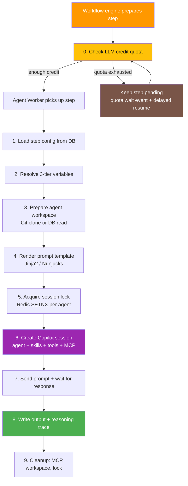

# Agent Steps

An **agent step** is the atomic unit of execution in a workflow. Each step runs inside an agent worker, creates a Copilot session, sends a rendered prompt, and writes the result back to the database. This page explains every phase of step execution in detail.

## Execution Pipeline



## 1. Load Step Configuration

The worker reads from the database:

| Record | Source Table | Key Fields |
|---|---|---|
| Step execution | `step_executions` | `id`, `stepOrder`, `status` |
| Workflow execution | `workflow_executions` | `workflowId`, `userId`, `triggerMetadata` |
| Workflow | `workflows` | `defaultAgentId`, `defaultModel`, `defaultReasoningEffort`, `workspaceId` |
| Step definition | `workflow_steps` | `promptTemplate`, `agentId`, `model`, `reasoningEffort`, `timeoutSeconds` |
| Agent | `agents` | `sourceType`, `gitRepoUrl`, `gitBranch`, `agentFilePath`, `skillsPaths`, `mcpJsonTemplate`, `builtinToolsEnabled` |

The agent for the step is resolved in order:
1. Step-level agent override (if set)
2. Workflow's default agent

## Quota-Gated Pending

Before a step is dispatched to a static worker or ephemeral pod, the workflow engine resolves the model that would be used and checks its `creditCost` against both user and workspace quota settings. Daily, weekly, and monthly limits are all considered.

If running the step would exceed a limit, the step stays in `pending` instead of failing. The workflow execution remains `running`, and the engine records a `quota_wait` event in `step_executions.liveOutput` with the model, credit cost, blocking limits, next retry time, and quota reset time. A delayed workflow job is queued to resume from the same step, so the step starts automatically after quota is raised or the limit window resets.

The UI surfaces this as **Waiting for quota** on the execution detail page and in the executions table. The Process Logs tab also shows the `quota_wait` event for auditability.

## Allocation-Gated Pending

After quota is available, the step can still remain `pending` while OAO waits for runtime capacity. Static steps wait for an available static agent worker to pick up the queued job. Ephemeral steps wait for a dynamic agent slot and retry Kubernetes pod creation until the workflow's allocation timeout expires.

During this phase the Process Logs tab shows an `allocation_wait` event with the runtime, reason, and allocation timeout. The step only fails once `stepAllocationTimeoutSeconds` is exceeded, which avoids premature failures when workers are briefly busy, rate-limited, restarting, or when a dynamic runtime is temporarily unavailable.

## 2. Variable Resolution (3-Tier Override)

Variables are loaded from three scopes and merged with higher scopes overriding lower ones:

```
Workspace Variables (lowest) → User Variables → Agent Variables (highest)
```

Each variable has a `variableType` (`credential` or `property`) and an optional `injectAsEnvVariable` flag:

- **Credentials** → available as <span v-pre>`{{ credentials.KEY }}`</span> in templates
- **Properties** → available as <span v-pre>`{{ properties.KEY }}`</span> in templates
- **Env-injected** → written to a `.env` file in the agent workspace directory

All values are stored encrypted (AES-256-GCM) and decrypted at resolution time. For full details on scoping and priority, see [Variables](/concepts/variables).

## 3. Prepare Agent Workspace

The workspace is where agent instructions and skills are loaded from. Two source types are supported:

### Git Repository (`sourceType: 'github'`)

1. Clone the repository to a temporary directory using `git clone --depth 1`
2. If a private repo, authenticate via `GIT_ASKPASS` with the encrypted GitHub token (resolved from a credential reference or inline token)
3. Optionally checkout a specific branch (`gitBranch`)
4. Read the **agent markdown file** from `agentFilePath` (e.g., `agents/data-analyst.md`)
5. Read **skill files** from explicit paths (`skillsPaths`) or scan a directory (`skillsDirectory`) for all `.md` files
6. Return the agent markdown, skill contents, and a temporary workdir path

### Database Editor (`sourceType: 'database'`)

1. Query `agent_files` table for all files belonging to the agent
2. The file marked `isMainFile: true` becomes the agent markdown
3. Other files become skills
4. Create a temporary directory and write files to disk (for MCP servers that need a filesystem)

After execution, the temporary workspace is cleaned up automatically.

## 4. Jinja2 Prompt Rendering

Step prompts are Jinja2 templates rendered with [Nunjucks](https://mozilla.github.io/nunjucks/) (a JavaScript Jinja2-compatible engine).

### Available Template Variables

| Variable | Type | Description |
|---|---|---|
| <span v-pre>`{{ precedent_output }}`</span> | `string` | Output from the previous step (empty for step 1 by default) |
| <span v-pre>`{{ properties.KEY }}`</span> | `string` | Property value from the 3-tier merged map |
| <span v-pre>`{{ credentials.KEY }}`</span> | `string` | Credential value from the 3-tier merged map |
| <span v-pre>`{{ env.KEY }}`</span> | `string` | Environment-injected variable value |
| <span v-pre>`{{ inputs.KEY }}`</span> | `string` | Webhook parameter / manual run input value |

For the full reference, see [Template Variables](/reference/template-variables).

### Jinja2 Features

Full Jinja2 syntax is supported — conditionals, loops, filters, and expressions:

```markdown
Analyze the market for {{ properties.MARKET_SYMBOL }}.
Current risk limit: {{ properties.MAX_RISK_PERCENT }}%


Previous analysis:
{{ precedent_output }}



- Check {{ symbol | trim }}

```

### Precedent Output

For **step 1**, precedent output is an empty string by default.

For **step N** (N > 1), precedent output is the `output` field of step N-1's execution record.

> **Tip:** Use <span v-pre>`{{ inputs.KEY }}`</span> to pass trigger parameters to step 1 instead of relying on precedent output.

## 5. Session Lock

Before creating a Copilot session, the worker acquires a Redis distributed lock:

- **Key**: `agent-session-lock:{agentId}`
- **TTL**: 10 minutes (auto-expires if the worker crashes)
- **Mechanism**: `SET NX EX` — only one worker can hold the lock
- **Release**: Lua script (compare-and-delete) prevents releasing another worker's lock

This ensures **one active Copilot session per agent** at any time.

If another execution is already using the same agent, the worker now waits briefly for the active session to finish before failing the step. This reduces false retry failures during session shutdown or near timeout boundaries.

## 6. Copilot Session Setup

The session is created with the GitHub Copilot SDK (`@github/copilot-sdk`):

### System Message

The system message is assembled from:
1. **Agent markdown** — the main personality/instructions file
2. **Skills** — additional markdown files appended under `## Agent Skills`
3. **Guidelines** — OAO appends autonomous-agent guidelines (explain reasoning, follow instructions)

### Tools

Tools are loaded in order and merged into a single array:

| Source | Description |
|---|---|
| **Built-in tools** (9 tools) | `schedule_next_workflow_execution`, `manage_webhook_trigger`, `record_decision`, `memory_store`, `memory_retrieve`, `edit_workflow`, `read_variables`, `edit_variables`, `simple_http_request` — filtered by `builtinToolsEnabled` |
| **MCP servers (JSON template)** | Agent's `mcpJsonTemplate` field rendered with Jinja2, parsed as JSON, and each server spawned. |

### Model Resolution

1. Step-level `model` override (if set)
2. Workflow-level `defaultModel` (if set)
3. `DEFAULT_AGENT_MODEL` env var (defaults to `gpt-4.1`)

### Reasoning Effort

Optional. If set on the step or workflow, passed to the Copilot session for models that support it (`high`, `medium`, `low`).

## 7. Prompt Execution

The rendered prompt is sent to the Copilot session:

```
session.sendAndWait({ prompt: resolvedPrompt }, timeoutMs)
```

- **Timeout**: Step-level `timeoutSeconds` (default: 300 seconds / 5 minutes)
- **Permission handling**: `approveAll` — all tool calls are auto-approved for workflow executions
- **Tool call tracking**: The worker listens to `tool.execution_start` events to build the reasoning trace

## 8. Write Results

After the session completes, the worker writes:

| Field | Table | Content |
|---|---|---|
| `output` | `step_executions` | The Copilot response text |
| `reasoningTrace` | `step_executions` | JSONB with: model used, agent file, skills paths, approximate token counts, list of tool calls (name + args) |
| `status` | `step_executions` | `completed` or `failed` |
| `agentQuotaUsage` | `agent_quota_usage` | Approximate prompt/completion tokens + session count (upserted per agent per day) |
| `creditUsage` | `credit_usage` | Credits consumed per user per model per day (based on model's `creditCost`) |

## 9. Cleanup

After execution (success or failure), the worker cleans up:

1. **MCP server processes** — all spawned MCP servers are terminated
2. **Agent workspace** — temporary Git clone directory deleted
3. **Session lock** — Redis lock released (Lua compare-and-delete)

The worker then returns to idle and picks up the next step from the BullMQ queue.
