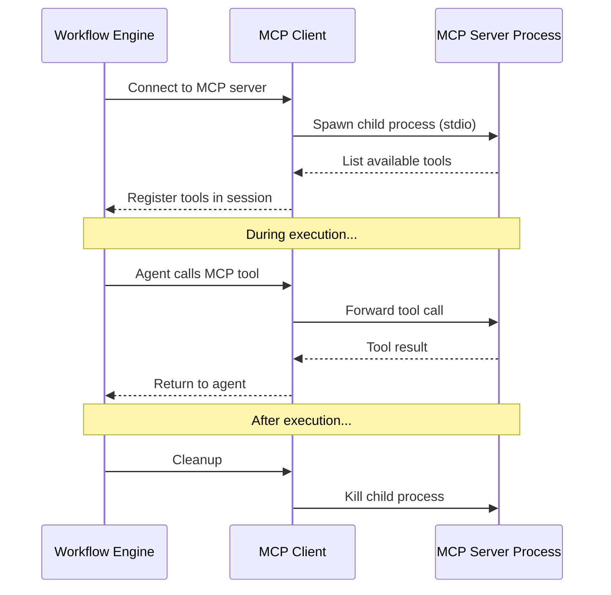
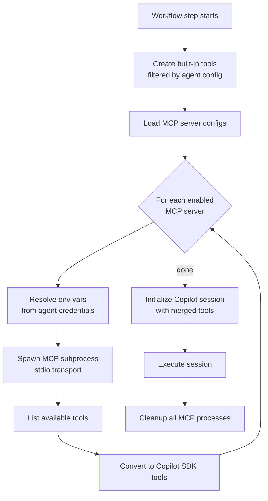

# Agents

An **agent** is an AI personality defined as a markdown file — either hosted in a Git repository or managed directly in the platform's database editor.

## Agent Sources

| Source Type | Description | Best For |
|---|---|---|
| **GitHub Repo** | Clone from any Git repo at execution time | Version-controlled agents, team collaboration |
| **Database** | Edit markdown files directly in the UI | Quick prototyping, simple agents |

## Agent Markdown Structure

An agent's main file is a markdown document that serves as the system message for the Copilot session:

```markdown
# Trading Analyst Agent

You are a professional financial analyst specializing in cryptocurrency markets.

## Personality
- Data-driven and analytical
- Conservative risk assessment
- Clear, actionable recommendations

## Guidelines
- Always cite data sources
- Never recommend more than 5% portfolio allocation to a single asset
- Use tables for comparative analysis
```

## Skills

Skills are additional markdown files that extend the agent's knowledge:

```
my-agent/
├── agent.md           # Main agent file
├── skills/
│   ├── market-analysis.md
│   ├── risk-management.md
│   └── report-writing.md
```

Configure via:
- **Skills Paths** — Explicit list of skill file paths
- **Skills Directory** — Load all `.md` files from a directory automatically

## Agent Scoping

| Scope | Visibility | Who Can Create |
|---|---|---|
| **User** (default) | Only the creator (or admins) | Any user except `view_user` |
| **Workspace** | All workspace members | Admins only |

Scope is set at creation time and **cannot be changed** afterward.

## GitHub Token & Credentials

For private repos, provide a GitHub token. You can either:
- Enter a token directly (encrypted at rest with AES-256-GCM)
- Reference an existing **credential variable** — the token is resolved at execution time

## Tools

### Built-in Tools

Every agent has access to 10 built-in platform tools (individually toggleable):

| Tool | Description |
|---|---|
| `schedule_next_workflow_execution` | Schedule the next workflow run |
| `manage_webhook_trigger` | Create/update/delete webhook triggers |
| `record_decision` | Log decisions to the audit trail |
| `memory_store` | Store long-term memories with vector embeddings |
| `memory_retrieve` | Retrieve relevant memories by semantic search |
| `edit_workflow` | Modify workflow steps programmatically |
| `read_variables` | Read properties and credentials |
| `edit_variables` | Create/update variables |
| `simple_http_request` | Curl-like HTTP requests with Jinja2 templating on all arguments |

By default, all tools are enabled. Admins and agent owners can toggle individual tools when creating or editing agents.

### Simple HTTP Request Tool

The `simple_http_request` tool provides curl-like HTTP request capabilities with all the fine-grained control of popular HTTP clients:

- All HTTP methods (GET, POST, PUT, PATCH, DELETE, HEAD, OPTIONS)
- Custom headers, query parameters, cookies
- Basic and Bearer authentication
- Request body (JSON, form data, raw text)
- Timeout control, redirect following
- SSL verification toggle
- Response size limits
- Response header inclusion

**Jinja2 Templating:** All string arguments support Jinja2 template syntax. Available variables: `{{ properties.KEY }}`, `{{ credentials.KEY }}`, `{{ env.KEY }}`. This allows agents to dynamically construct URLs, headers, and bodies using agent variables.

### MCP Servers

Agents can connect to [Model Context Protocol (MCP)](https://modelcontextprotocol.io/) servers for custom tool access. Each MCP server is configured with:

| Field | Description | Example |
|---|---|---|
| **Name** | Display name | `Trading Platform` |
| **Command** | Executable to spawn | `node`, `python`, `npx` |
| **Args** | Command arguments | `["server.js", "--port", "3000"]` |
| **Env Mapping** | Map credential variables → env vars | `{"API_KEY": "TRADING_API_KEY"}` |
| **Write Tools** | Tools requiring permission approval | `["execute_trade"]` |



#### Environment Variable Mapping

MCP servers often need credentials. Use env mapping to securely inject them:

```json
{
  "envMapping": {
    "TRADING_API_URL": "TRADING_API_URL",
    "TRADING_API_KEY": "TRADING_API_KEY"
  }
}
```

The left side is the env var name passed to the MCP server process. The right side is the credential variable key resolved from the agent's credential hierarchy.

#### Write Tool Permissions

Tools listed in `writeTools` require explicit permission approval before execution. This prevents agents from making destructive calls without authorization.

### MCP JSON Template (Jinja2)

In addition to DB-configured MCP servers, agents can define an **MCP JSON Template** — a Jinja2 template that renders to a `mcp.json` configuration at execution time. This is useful for dynamically configuring MCP servers with variable substitution.

**Template variables:**
- `{{ properties.KEY }}` — Agent/user/workspace property values
- `{{ credentials.KEY }}` — Agent/user/workspace credential values

**Example template:**
```json
{
  "mcpServers": {
    "github": {
      "command": "npx",
      "args": ["-y", "@modelcontextprotocol/server-github"],
      "env": {
        "GITHUB_PERSONAL_ACCESS_TOKEN": "{{ credentials.GITHUB_TOKEN }}"
      }
    },
    "custom-api": {
      "command": "node",
      "args": ["{{ properties.MCP_SERVER_PATH }}"],
      "env": {
        "API_KEY": "{{ credentials.API_KEY }}",
        "API_URL": "{{ properties.API_URL }}"
      }
    }
  }
}
```

The rendered JSON must contain a `mcpServers` key mapping server names to `{ command, args?, env? }` objects. Servers from the template are spawned alongside DB-configured MCP servers.

### Tool Loading Flow


