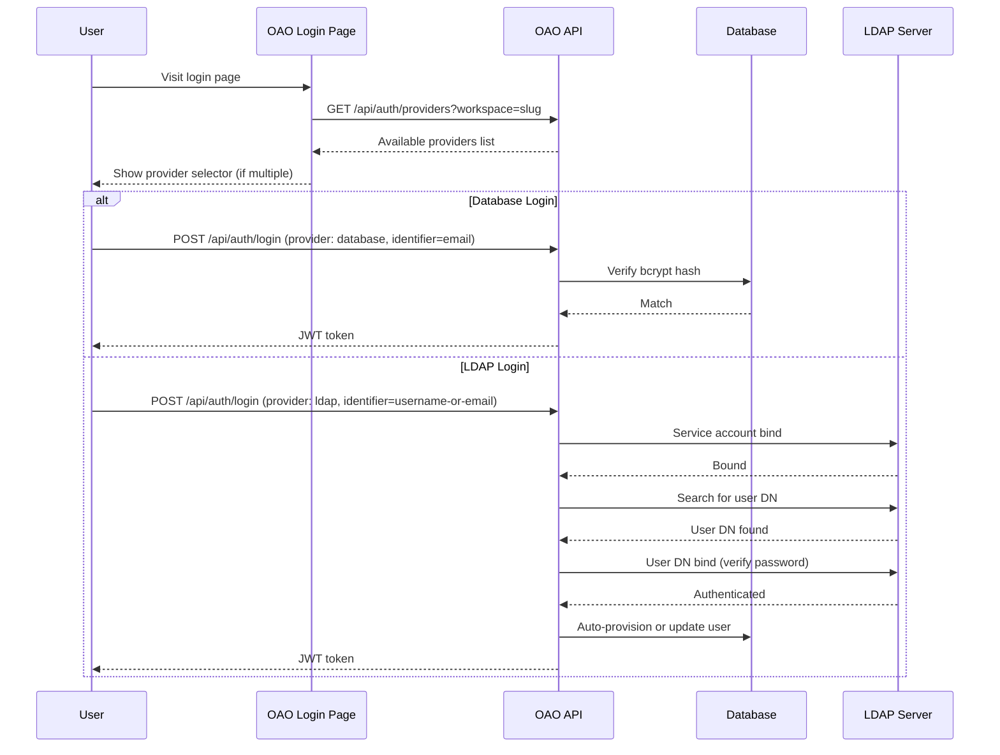

# Authentication Providers

OAO supports **multi-provider authentication**, allowing workspaces to configure one or more authentication methods for their users. This is similar to what identity providers like Keycloak offer, but built directly into OAO.

## Supported Providers

| Provider | Description |
|----------|-------------|
| **Database** | Built-in username/password authentication with bcrypt-hashed passwords. Always available. |
| **LDAP** | LDAP / Active Directory integration. Users authenticate against an external directory server. |

## How It Works

## LDAP Provider Configuration

LDAP providers are configured per workspace via **Admin → Auth Providers**.

| Setting | Description | Example |
|---------|-------------|---------|
| Server URL | LDAP server address | `ldap://ldap.example.com:389` |
| Bind DN | Service account DN for searching | `cn=admin,dc=example,dc=com` |
| Bind Password | Service account password (encrypted at rest) | `***` |
| Search Base | Base DN to search for users | `ou=users,dc=example,dc=com` |
| Search Filter | LDAP filter with `{{username}}` placeholder | `(uid={{username}})` |
| Username Attribute | Attribute for username | `uid` |
| Email Attribute | Attribute for email | `mail` |
| Name Attribute | Attribute for display name | `cn` |
| Start TLS | Upgrade connection to TLS | `true` / `false` |
| Verify TLS Certificates | Reject untrusted certificates | `true` / `false` |

### Active Directory Example

For Microsoft Active Directory, typical settings:

| Setting | Value |
|---------|-------|
| Server URL | `ldap://dc.corp.example.com:389` |
| Bind DN | `cn=svc-oao,ou=service-accounts,dc=corp,dc=example,dc=com` |
| Search Base | `ou=employees,dc=corp,dc=example,dc=com` |
| Search Filter | `(sAMAccountName={{username}})` |
| Username Attribute | `sAMAccountName` |
| Email Attribute | `mail` |
| Name Attribute | `displayName` |

## Auto-Provisioning

When an LDAP user logs in for the first time, OAO automatically creates a local user record with:

- **Name** and **email** from the LDAP directory attributes
- **Auth provider** set to `ldap`
- **No password hash** (authentication is delegated to LDAP)
- **Default role** of `creator_user`

On subsequent logins, the user's name and email are updated from LDAP to stay in sync.

## Login Identifier Semantics

- **Database login** expects the identifier to be an email address.
- **LDAP login** accepts a generic identifier string, because the LDAP search filter may target `mail`, `uid`, `cn`, `sAMAccountName`, or another attribute.
- The OAO login UI therefore presents LDAP as **Username or Email**, not email-only.

## Password Management

- **Database users**: Can change passwords via Settings → Change Password
- **Forgot password**: Workspace admins can enable or disable self-service reset emails from **Admin → Security**. When disabled, the login page hides the forgot-password link and the API rejects reset requests for that workspace.
- **LDAP users**: Password changes are managed by the external LDAP directory. The Change Password page shows an informational message instead of the form.

## Provider Priority

When multiple providers of the same type exist, they are tried in **priority order** (**higher** number = higher priority). This allows fallback configurations.

## Security

- Bind credentials are encrypted at rest using **AES-256-GCM**
- LDAP usernames are escaped per RFC 4515 to prevent LDAP injection
- TLS/STARTTLS support for encrypted connections
- Connection test endpoint available for administrators to verify configuration
