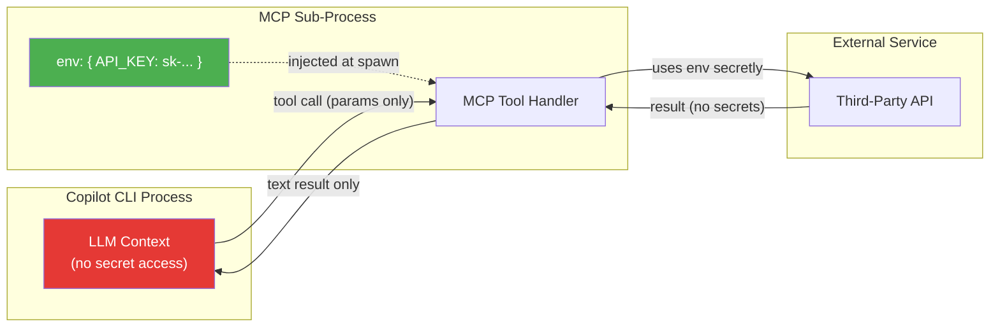

# Copilot CLI Security

When using the GitHub Copilot CLI with MCP servers, your environment variables and secrets are generally protected through process isolation. However, there are specific configuration risks you should manage to ensure the LLM cannot "see" them.

For OAO's server-side credential injection approach, see [AI Security](/concepts/security).

## How Copilot CLI Handles Your Secrets

When you configure an MCP server in the CLI (typically stored in `mcp-config.json`), the secrets you provide are handled as follows:

**Process Isolation** — The Copilot CLI starts your MCP server as a local sub-process using the `env` object you define in your JSON. The LLM interacts with this sub-process through standardized tools and commands; it does **not** have direct access to the process's internal environment variables.

**Context Separation** — The value of a secret (like an API token) is used by the MCP server to authenticate with external services. This value is **not** automatically sent into the LLM's "chat context" — unless your specific MCP tool is poorly written and explicitly returns the token in its text output.

## Security Risks & How to Avoid Them

| Risk | Problem | Mitigation |
|------|---------|------------|
| **Hardcoded secrets in `mcp-config.json`** | Anyone with access to your machine (or a backup of your home directory) can read raw tokens | Use shell variable expansion: `"TOKEN": "${MY_SECRET_ENV}"`, or set the variable in your terminal before running the CLI |
| **Leaky MCP tool output** | A poorly written MCP tool might return the token in its text response, leaking it into the LLM context | Always sanitize tool outputs — never echo secrets back. Validate that tool responses contain only data, not credentials |
| **Prompt injection via tool results** | An attacker-controlled API response could trick the LLM into exfiltrating secrets | Treat all external tool results as untrusted. Use write-tool permission controls for destructive actions |
| **Config file in version control** | Committing `mcp-config.json` with secrets to Git | Add `mcp-config.json` to `.gitignore`. Use environment variable references instead of raw values |

## OAO's Enhanced Protection

OAO goes beyond Copilot CLI defaults by adding server-side credential injection:

| Copilot CLI (Default) | OAO Platform |
|---|---|
| Secrets stored in local `mcp-config.json` | Secrets stored AES-256-GCM encrypted in database |
| User manually manages env vars | 3-tier scoped variable system (workspace → user → agent) |
| LLM could see secrets if MCP tool leaks them | Jinja2 templates render secrets server-side — agent never sees raw values |
| No audit trail | All credential access is logged and auditable |
| Single user | Multi-tenant workspace isolation |

## Best Practices for Copilot CLI Users

1. **Never hardcode secrets** in `mcp-config.json` — use environment variable references (`"TOKEN": "${MY_SECRET_ENV}"`)
2. **Add `mcp-config.json` to `.gitignore`** — prevent accidental commits
3. **Audit MCP tool outputs** — ensure tools never echo credentials back in their text responses
4. **Use write-tool permissions** — mark destructive MCP tools to require approval
5. **Treat external tool results as untrusted** — guard against prompt injection via API responses

## Next Steps

- [AI Security](/concepts/security) — OAO's zero credential exposure architecture
- [Variables](/concepts/variables) — Manage credentials at all three tiers
- [Agents](/concepts/agents) — Configure MCP JSON templates
