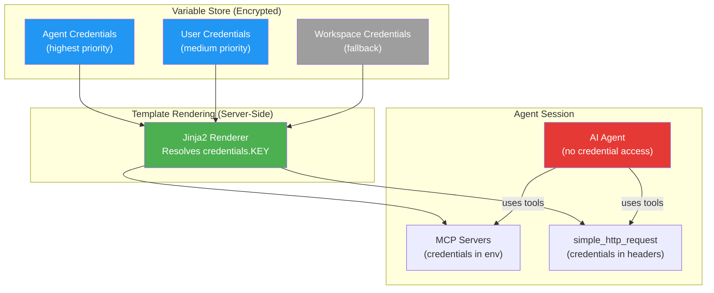
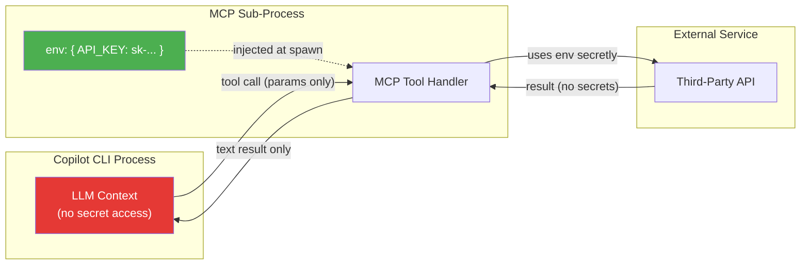

# AI Security

OAO enforces a **zero credential exposure** policy — AI agents **never** see or access credentials directly. Instead, credentials are injected into MCP server configs and HTTP request headers via Jinja2 templates at runtime, before the agent session begins.

## The Principle: Never Let Agents Access Credentials

Traditional AI frameworks expose credentials as environment variables that agents can read freely. This creates serious risks:

- **Credential leakage** — An agent could log, transmit, or misuse a credential
- **No isolation** — Every agent can access every credential
- **Exfiltration risk** — A compromised agent prompt could extract secrets

**OAO's approach**: Credentials exist only as encrypted values in the variable store. They are resolved and injected into configuration templates (MCP JSON, HTTP headers) *before* the agent session starts. The agent interacts with pre-configured tools that already have authentication baked in — it never sees the raw credential.

## How It Works: Jinja2 Template + Scoped Credentials

OAO uses a **Jinja2 template approach** combined with the **3-tier scoped credential system** (agent → user → workspace) to securely pass credentials into tool configurations.

### The 3-Tier Variable System

Credentials (and properties) are stored encrypted at three scopes:

```
Agent Variables     (highest priority — most specific)
    ↓ fallback
User Variables      (medium priority)
    ↓ fallback
Workspace Variables (lowest priority — shared defaults)
```

You manage these via **Admin → Variables** in the UI, or via the `/api/variables` API.

### Template Syntax

All Jinja2 templates have access to these variables:

| Variable | Description |
|---|---|
| <span v-pre>`{{ credentials.KEY }}`</span> | Decrypted credential value from 3-tier lookup |
| <span v-pre>`{{ properties.KEY }}`</span> | Property (non-secret) value from 3-tier lookup |
| <span v-pre>`{{ env.KEY }}`</span> | Server environment variable |
| <span v-pre>`{{ precedent_output }}`</span> | Previous workflow step output (in prompts) |

## Method 1: MCP JSON Template (Recommended for API Integrations)

The most powerful approach: define an `mcp.json` template on the agent that configures MCP servers with credentials baked into their launch arguments.

### Setting Up

1. Go to **Agents → [Your Agent] → MCP JSON Template**
2. Write a Jinja2 template that references your scoped credentials

### Example: `mcp.json.template`

This template configures an MCP server that connects to a third-party API:

```json
{
  "mcpServers": {
    "financial-data": {
      "command": "npx",
      "args": [
        "-y",
        "@example/financial-mcp-server"
      ],
      "env": {
        "API_KEY": "{{ credentials.FINANCIAL_API_KEY }}",
        "API_SECRET": "{{ credentials.FINANCIAL_API_SECRET }}",
        "BASE_URL": "{{ properties.FINANCIAL_API_URL }}"
      }
    },
    "slack-notifications": {
      "command": "npx",
      "args": ["-y", "@example/slack-mcp-server"],
      "env": {
        "SLACK_TOKEN": "{{ credentials.SLACK_BOT_TOKEN }}",
        "DEFAULT_CHANNEL": "{{ properties.SLACK_CHANNEL }}"
      }
    }
  }
}
```

**What happens at runtime:**
1. OAO resolves `credentials.FINANCIAL_API_KEY` from the 3-tier variable store and decrypts it
2. The template is rendered into a concrete `mcp.json` configuration
3. MCP servers are launched with the resolved credentials in their environment
4. The agent interacts with MCP tools — it never sees the raw API keys

## Method 2: `simple_http_request` Tool with Jinja2 Templating

For quick API integrations without a dedicated MCP server, agents can use the built-in `simple_http_request` tool. **All string arguments support Jinja2 templating**, so credentials are injected at render time — the agent describes *what* to call, and the template engine handles authentication.

### Example: Agent Markdown Instruction

In your agent's instruction file (`.md`), tell the agent how to use the tool:

```markdown
## API Access

To fetch financial data, use the `simple_http_request` tool:

- **URL**: `{{ properties.FINANCIAL_API_URL }}/v1/quotes`
- **Headers**: `{"Authorization": "Bearer {{ credentials.FINANCIAL_API_KEY }}", "Content-Type": "application/json"}`
- **Method**: GET

To post a Slack message:

- **URL**: `https://slack.com/api/chat.postMessage`
- **Headers**: `{"Authorization": "Bearer {{ credentials.SLACK_BOT_TOKEN }}", "Content-Type": "application/json"}`
- **Method**: POST
- **Body**: `{"channel": "{{ properties.SLACK_CHANNEL }}", "text": "<your message>"}`
```

### How the Agent Uses It

When the agent calls `simple_http_request`, it passes the template strings as arguments:

```
simple_http_request(
  url="{{ properties.FINANCIAL_API_URL }}/v1/quotes?symbol=AAPL",
  method="GET",
  headers='{"Authorization": "Bearer {{ credentials.FINANCIAL_API_KEY }}"}'
)
```

**What happens:**
1. The workflow engine renders all string arguments through Jinja2
2. <span v-pre>`{{ credentials.FINANCIAL_API_KEY }}`</span> is resolved and decrypted from the variable store
3. The actual HTTP request is made with the real credential in the header
4. The agent receives the response — it never saw the raw API key

### Authentication Patterns

**Bearer Token:**
```
headers='{"Authorization": "Bearer {{ credentials.API_TOKEN }}"}'
```

**Basic Auth:**
```
auth_type="basic"
auth_value="{{ credentials.API_USER }}:{{ credentials.API_PASSWORD }}"
```

**API Key in Header:**
```
headers='{"X-API-Key": "{{ credentials.SERVICE_API_KEY }}"}'
```

**API Key in Query Parameter:**
```
query_params='{"api_key": "{{ credentials.SERVICE_API_KEY }}"}'
```

## Method 3: Prompt Template Variables (Workflow Steps)

Workflow step prompt templates also support Jinja2. While you should **never** put raw credentials in prompts, you can use properties to inject non-secret configuration:

```
Analyze the data for {{ properties.DATA_SOURCE }}.
Use the analytics MCP tool to fetch the latest metrics.
The previous analysis was: {{ precedent_output }}
```

## Setting Up Scoped Credentials

### Via the UI

1. Navigate to **Agents → [Agent Name] → Variables**
2. Click **"Add Variable"**
3. Set:
   - **Key**: `FINANCIAL_API_KEY` (UPPER_SNAKE_CASE)
   - **Type**: `credential` (encrypted at rest)
   - **Scope**: Agent / User / Workspace
   - **Value**: your secret value

### Via the API

```bash
POST /api/variables
{
  "key": "FINANCIAL_API_KEY",
  "value": "sk-live-abc123...",
  "variableType": "credential",
  "scope": "agent",
  "agentId": "uuid-of-agent"
}
```

Credentials are encrypted with AES-256-GCM before storage and only decrypted during Jinja2 template rendering.

## Security Architecture



**Key guarantee**: The agent node (red) has no direct path to the encrypted variable store. Credentials flow through the Jinja2 renderer (green) into pre-configured tools only.

## Copilot CLI & Secret Handling {#copilot-cli-secrets}

When using the GitHub Copilot CLI with MCP servers, your environment variables and secrets are generally protected through process isolation. However, there are specific configuration risks you should manage to ensure the LLM cannot "see" them.

### How Copilot CLI Handles Your Secrets

When you configure an MCP server in the CLI (typically stored in `mcp-config.json`), the secrets you provide are handled as follows:

**Process Isolation** — The Copilot CLI starts your MCP server as a local sub-process using the `env` object you define in your JSON. The LLM interacts with this sub-process through standardized tools and commands; it does **not** have direct access to the process's internal environment variables.

**Context Separation** — The value of a secret (like an API token) is used by the MCP server to authenticate with external services. This value is **not** automatically sent into the LLM's "chat context" — unless your specific MCP tool is poorly written and explicitly returns the token in its text output.



### Security Risks & How to Avoid Them

| Risk | Problem | Mitigation |
|------|---------|------------|
| **Hardcoded secrets in `mcp-config.json`** | Anyone with access to your machine (or a backup of your home directory) can read raw tokens | Use shell variable expansion: `"TOKEN": "${MY_SECRET_ENV}"`, or set the variable in your terminal before running the CLI |
| **Leaky MCP tool output** | A poorly written MCP tool might return the token in its text response, leaking it into the LLM context | Always sanitize tool outputs — never echo secrets back. Validate that tool responses contain only data, not credentials |
| **Prompt injection via tool results** | An attacker-controlled API response could trick the LLM into exfiltrating secrets | Treat all external tool results as untrusted. Use write-tool permission controls for destructive actions |
| **Config file in version control** | Committing `mcp-config.json` with secrets to Git | Add `mcp-config.json` to `.gitignore`. Use environment variable references instead of raw values |

### OAO's Enhanced Protection

OAO goes beyond Copilot CLI defaults by adding server-side credential injection:

| Copilot CLI (Default) | OAO Platform |
|---|---|
| Secrets stored in local `mcp-config.json` | Secrets stored AES-256-GCM encrypted in database |
| User manually manages env vars | 3-tier scoped variable system (workspace → user → agent) |
| LLM could see secrets if MCP tool leaks them | Jinja2 templates render secrets server-side — agent never sees raw values |
| No audit trail | All credential access is logged and auditable |
| Single user | Multi-tenant workspace isolation |

## Best Practices

1. **Use MCP JSON templates** for complex API integrations — they provide the cleanest separation
2. **Use `simple_http_request`** with Jinja2 headers for quick one-off API calls
3. **Never put credentials in prompt templates** — use `properties.*` for non-secret config instead
4. **Use agent-level credentials** for agent-specific secrets (most restrictive)
5. **Use workspace-level credentials** for shared infrastructure (e.g., Slack, monitoring)
6. **Rotate credentials** regularly — update in the variable store, agents pick up changes automatically
7. **Use descriptive key names** — `STRIPE_LIVE_API_KEY` is clearer than `KEY1`
8. **Never hardcode secrets** in `mcp-config.json` — use environment variable references or OAO's variable system
9. **Audit MCP tool outputs** — ensure tools never echo credentials back in their text responses
10. **Use write-tool permissions** — mark destructive MCP tools as `writeTools` to require approval

## Next Steps

- [Variables](/concepts/variables) — Manage credentials at all three tiers
- [Agents](/concepts/agents) — Configure MCP JSON templates and built-in tools
- [Workflows](/concepts/workflows) — Jinja2 in prompt templates
- [Admin Settings](/concepts/admin) — Workspace management
