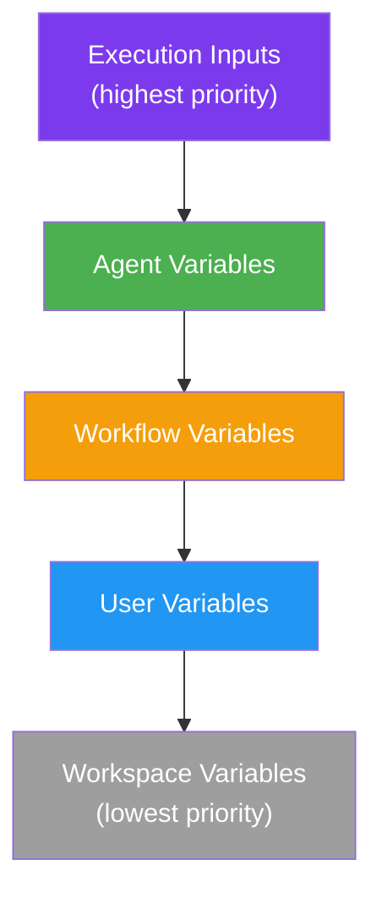

# Variables

The platform provides encrypted variables for shared configuration, user-level overrides, agent-level credentials, and workflow-level runtime properties.

The UI manages variables from these surfaces:

- `/{workspace}/variables` — list and edit workspace and user-scoped variables
- `/{workspace}/variables/{scope}/{id}` — latest editable variable page for workspace and user scopes, plus direct deep links when needed
- `/{workspace}/variables/{scope}/{id}/v/{version}` — read-only historical variable page
- `/{workspace}/agents/{id}?tab=variables` — agent-scoped variable CRUD on the agent detail page
- `/{workspace}/workflows/{id}?tab=variables` — workflow-scoped variable CRUD on the workflow detail page

## Variable Types

| Type | Storage | Use Case |
|---|---|---|
| **Credential** | AES-256-GCM encrypted | API keys, tokens, passwords — injected into Copilot session credential map |
| **Property** | AES-256-GCM encrypted | Configuration values, settings — injectable into prompt templates |
| **Short Memory** | JSONB (per-agent KV with TTL) | Persistent agent recollection across executions — see [Visual Workflows](/concepts/visual-workflows#variables-and-memory) |

## Properties

Properties are injected into prompt templates using `{{ properties.KEY }}` syntax:

```txt
Analyze the market for {{ properties.MARKET_SYMBOL }}.
Current risk tolerance: {{ properties.RISK_LEVEL }}.
```

The engine replaces these tokens with decrypted values before sending to Copilot.

## Credentials

Credentials are injected into the Copilot session's credential map. They are used by:
- **MCP JSON templates** — via Jinja2 <span v-pre>`{{ credentials.KEY }}`</span> to pass credentials as environment variables to MCP servers
- **`simple_http_request` tool** — via Jinja2 <span v-pre>`{{ credentials.KEY }}`</span> in headers, auth, and URLs
- **Prompt templates** — via Jinja2 <span v-pre>`{{ credentials.KEY }}`</span> (use <span v-pre>`{{ properties.KEY }}`</span> for non-secret config instead)
- **Git authentication** — agents can reference a credential and OAO applies subtype-specific checkout behavior
- **Model authentication** — agents can reference a credential variable to override the default GitHub Copilot token / LLM API key

Credentials are **never exposed to agents directly**. They are resolved server-side during Jinja2 template rendering. See [AI Security](/concepts/security).

When displayed in the UI or via `read_variables`, credential values are **masked**.

Structured credential subtypes such as GitHub App, User Account, Private Key, and Certificate are serialized as encrypted JSON payloads so the runtime can apply subtype-specific behavior without exposing the underlying fields in the agent configuration.

## Scoping & Priority

Variables resolve across five levels during execution. When the same key exists at multiple levels, the most specific scope wins:



**Resolution order**: Execution → Agent → Workflow → User → Workspace

Workflow-scoped variables only participate when the agent is running inside that workflow.

## Versioning

Workspace, user, and agent variables are first-class versioned resources.

- The latest editable page lives at `/{workspace}/variables/{scope}/{id}`
- Historical snapshots live at `/{workspace}/variables/{scope}/{id}/v/{version}`
- Direct navigation to a historical URL opens that dedicated read-only snapshot view rather than the latest editable variable page
- Updating a variable increments that variable's version and stores the previous snapshot
- Deleting a variable preserves a final read-only historical snapshot marked as deleted
- Agent-scoped variable changes also increment the owning agent version so agent history remains aligned with its files and variables

Workflow-scoped variables are versioned through workflow history on the workflow detail page rather than the generic `/variables` routes.

Credential values remain masked in both live and historical views. Version history tracks metadata, scope, env-injection settings, and lifecycle state without exposing the stored secret.

### Example

If `API_KEY` is defined at every level during a workflow run:

| Scope | Value | Resolved? |
|---|---|---|
| Workspace | `ws-key-123` | No |
| User | `user-key-456` | No |
| Workflow | `wf-key-789` | No |
| Agent | `agent-key-999` | No |
| Execution | `run-key-123` | **Yes** ← wins |

## Environment Variable Injection

Any variable (credential or property) can be flagged with `injectAsEnvVariable: true`. When enabled, the variable is written to a `.env` file in the agent's temporary workspace directory before execution:

```ini
API_KEY=resolved-value
DATABASE_URL=postgres://...
```

This is useful for MCP servers and tools that read from environment variables.

## Key Format

All variable keys must match: `^[A-Z_][A-Z0-9_]*$` (UPPER_SNAKE_CASE)

**Valid**: `API_KEY`, `MARKET_SYMBOL`, `MAX_RISK_PERCENT`
**Invalid**: `apiKey`, `my-variable`, `123_KEY`

## Access Control

| Role | User Variables | Workspace Variables | Agent Variables | Workflow Variables |
|---|---|---|---|---|
| `super_admin` | Full CRUD | Full CRUD | Full CRUD | Full CRUD |
| `workspace_admin` | Full CRUD | Full CRUD | Full CRUD | Full CRUD |
| `creator_user` | Own only | Read only | Own agents only | Own workflows only |
| `view_user` | Read own | Read only | Read only | Read only |

## Credential Reference

When creating or editing agents, authentication selectors load **credential variables** from the available scopes:

- **Agent variables**
- **User variables**
- **Workspace variables**

For Git checkout, OAO interprets the selected credential subtype automatically:

- **GitHub Token / Secret Text** — token-based HTTPS checkout
- **GitHub App** — installation token exchange at runtime
- **User Account** — username/password HTTPS checkout

For model authentication, use a **GitHub Token** or **Secret Text** credential variable. The credential is resolved at execution time, keeping the actual secret out of the agent configuration.

OAO uses the selected credential differently depending on the workspace model record:

- **GitHub provider models** use it as the Copilot `githubToken`
- **Custom provider models** use it as the `apiKey` or `bearerToken` inside `SessionConfig.provider`

## API Examples

### Create a credential

```bash
curl -X POST http://localhost:4002/api/variables \
  -H "Authorization: Bearer $TOKEN" \
  -H "Content-Type: application/json" \
  -d '{
    "scope": "user",
    "key": "GITHUB_TOKEN",
    "value": "ghp_xxxxxxxxxxxx",
    "variableType": "credential",
    "description": "GitHub personal access token"
  }'
```

### Create a property

```bash
curl -X POST http://localhost:4002/api/variables \
  -H "Authorization: Bearer $TOKEN" \
  -H "Content-Type: application/json" \
  -d '{
    "scope": "workspace",
    "key": "DEFAULT_API_URL",
    "value": "https://api.example.com",
    "variableType": "property",
    "description": "Shared API endpoint for all agents"
  }'
```

### Create an agent variable (overrides workspace/user)

```bash
curl -X POST http://localhost:4002/api/variables \
  -H "Authorization: Bearer $TOKEN" \
  -H "Content-Type: application/json" \
  -d '{
    "scope": "agent",
    "agentId": "uuid-of-agent",
    "key": "API_KEY",
    "value": "sk-...",
    "variableType": "credential",
    "injectAsEnvVariable": true
  }'
```

### Create a workflow variable

```bash
curl -X PUT http://localhost:4002/api/workflow-graph/<workflow-id>/variables \
  -H "Authorization: Bearer $TOKEN" \
  -H "Content-Type: application/json" \
  -d '{
    "key": "API_KEY",
    "value": "wf-override",
    "type": "credential",
    "description": "Workflow-specific override"
  }'
```
