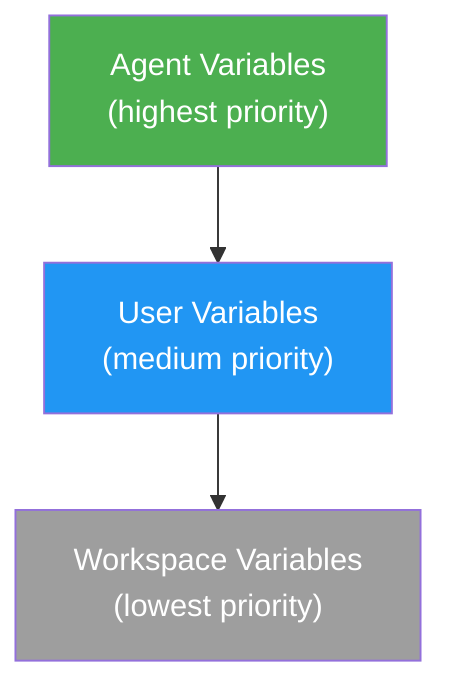

# Variables

The platform provides a three-tier encrypted variable system for managing credentials and configuration.

The UI manages variables with in-page breadcrumb workflows:

- `/{workspace}/variables` — list all workspace, user, and agent-scoped variables
- `/{workspace}/variables/new` — create a new credential or property
- `/{workspace}/variables/:id` — edit metadata or rotate the stored secret value

## Variable Types

| Type | Storage | Use Case |
|---|---|---|
| **Credential** | AES-256-GCM encrypted | API keys, tokens, passwords — injected into Copilot session credential map |
| **Property** | AES-256-GCM encrypted | Configuration values, settings — injectable into prompt templates |

## Properties

Properties are injected into prompt templates using <code v-pre>{{ Properties.KEY }}</code> syntax:

```txt
Analyze the market for {⁣{ Properties.MARKET_SYMBOL }⁣}.
Current risk tolerance: {⁣{ Properties.RISK_LEVEL }⁣}.
```

The engine replaces these tokens with decrypted values before sending to Copilot.

## Credentials

Credentials are injected into the Copilot session's credential map. They are used by:
- **MCP JSON templates** — via Jinja2 <span v-pre>`{{ credentials.KEY }}`</span> to pass credentials as environment variables to MCP servers
- **`simple_http_request` tool** — via Jinja2 <span v-pre>`{{ credentials.KEY }}`</span> in headers, auth, and URLs
- **Prompt templates** — via Jinja2 <span v-pre>`{{ credentials.KEY }}`</span> (use <span v-pre>`{{ properties.KEY }}`</span> for non-secret config instead)
- **Git authentication** — agents can reference a credential and OAO applies subtype-specific checkout behavior
- **Copilot authentication** — agents can reference a credential variable to override the default GitHub Copilot token

Credentials are **never exposed to agents directly**. They are resolved server-side during Jinja2 template rendering. See [AI Security](/concepts/security).

When displayed in the UI or via `read_variables`, credential values are **masked**.

Structured credential subtypes such as GitHub App, User Account, Private Key, and Certificate are serialized as encrypted JSON payloads so the runtime can apply subtype-specific behavior without exposing the underlying fields in the agent configuration.

## Scoping & Priority

Variables exist at three levels. When the same key exists at multiple levels, the most specific scope wins:



**Resolution order**: Agent → User → Workspace

### Example

If `API_KEY` is defined at all three levels:

| Scope | Value | Resolved? |
|---|---|---|
| Workspace | `ws-key-123` | No |
| User | `user-key-456` | No |
| Agent | `agent-key-789` | **Yes** ← wins |

## Environment Variable Injection

Any variable (credential or property) can be flagged with `injectAsEnvVariable: true`. When enabled, the variable is written to a `.env` file in the agent's temporary workspace directory before execution:

```ini
API_KEY=resolved-value
DATABASE_URL=postgres://...
```

This is useful for MCP servers and tools that read from environment variables.

## Key Format

All variable keys must match: `^[A-Z_][A-Z0-9_]*$` (UPPER_SNAKE_CASE)

**Valid**: `API_KEY`, `MARKET_SYMBOL`, `MAX_RISK_PERCENT`
**Invalid**: `apiKey`, `my-variable`, `123_KEY`

## Access Control

| Role | User Variables | Workspace Variables | Agent Variables |
|---|---|---|---|
| `super_admin` | Full CRUD | Full CRUD | Full CRUD |
| `workspace_admin` | Full CRUD | Full CRUD | Full CRUD |
| `creator_user` | Own only | Read only | Own agents only |
| `view_user` | Read own | Read only | Read only |

## Credential Reference

When creating or editing agents, authentication selectors load **credential variables** from the available scopes:

- **Agent variables**
- **User variables**
- **Workspace variables**

For Git checkout, OAO interprets the selected credential subtype automatically:

- **GitHub Token / Secret Text** — token-based HTTPS checkout
- **GitHub App** — installation token exchange at runtime
- **User Account** — username/password HTTPS checkout

For Copilot authentication, use a **GitHub Token** (or compatible Secret Text) credential variable. The credential is resolved at execution time, keeping the actual secret out of the agent configuration.

## API Examples

### Create a credential

```bash
curl -X POST http://localhost:4002/api/variables \
  -H "Authorization: Bearer $TOKEN" \
  -H "Content-Type: application/json" \
  -d '{
    "scope": "user",
    "key": "GITHUB_TOKEN",
    "value": "ghp_xxxxxxxxxxxx",
    "variableType": "credential",
    "description": "GitHub personal access token"
  }'
```

### Create a property

```bash
curl -X POST http://localhost:4002/api/variables \
  -H "Authorization: Bearer $TOKEN" \
  -H "Content-Type: application/json" \
  -d '{
    "scope": "workspace",
    "key": "DEFAULT_API_URL",
    "value": "https://api.example.com",
    "variableType": "property",
    "description": "Shared API endpoint for all agents"
  }'
```

### Create an agent variable (overrides workspace/user)

```bash
curl -X POST http://localhost:4002/api/variables \
  -H "Authorization: Bearer $TOKEN" \
  -H "Content-Type: application/json" \
  -d '{
    "scope": "agent",
    "agentId": "uuid-of-agent",
    "key": "API_KEY",
    "value": "sk-...",
    "variableType": "credential",
    "injectAsEnvVariable": true
  }'
```
