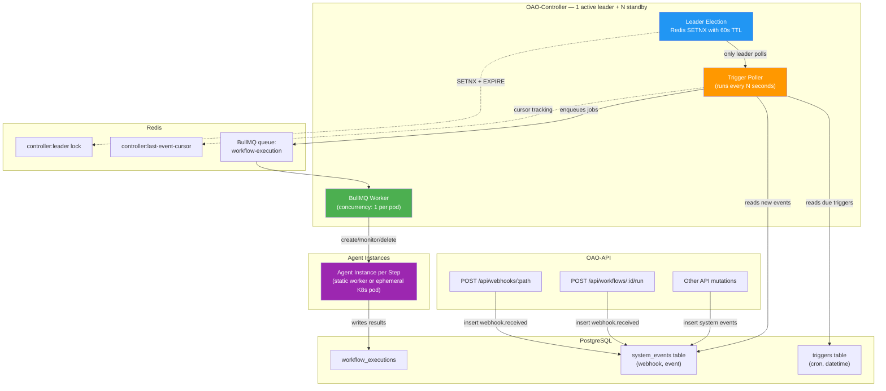
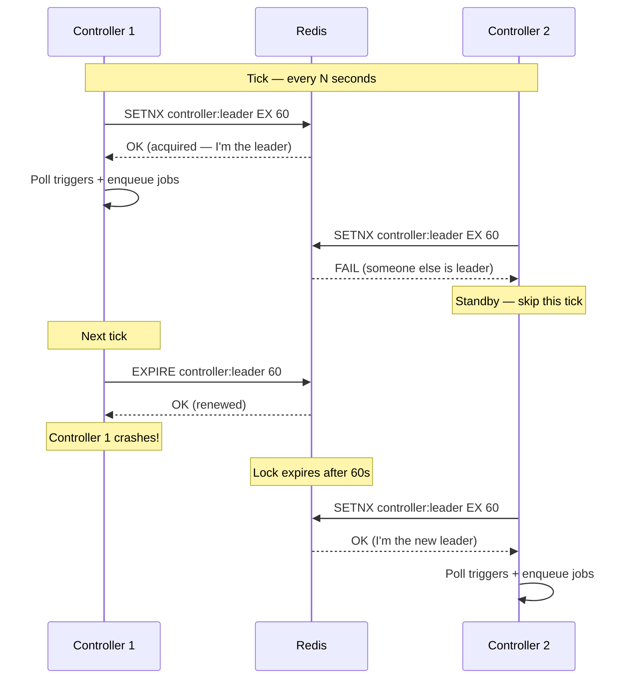
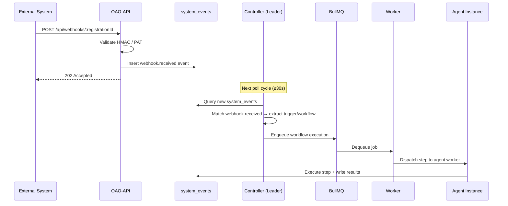
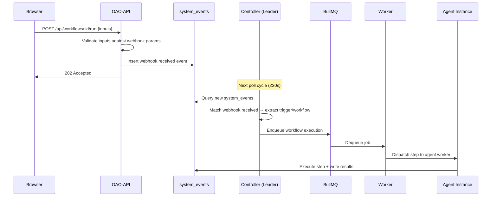
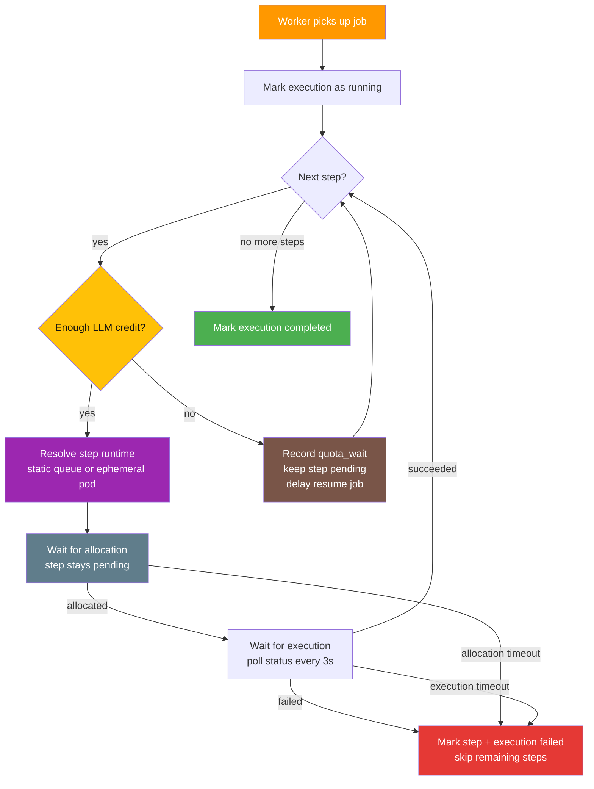
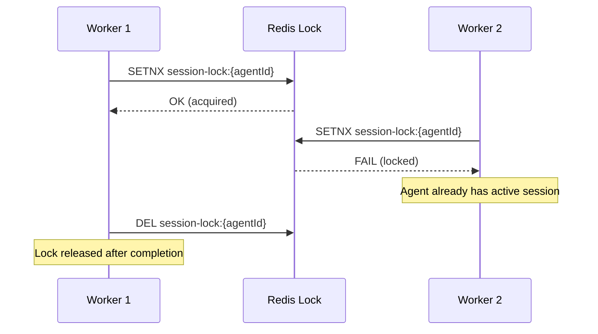
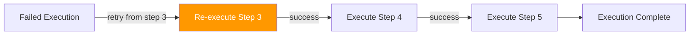

# Workflow Engine & Controller

The **Workflow Engine** orchestrates multi-step workflow executions by dispatching steps to agent workers. The **Controller** is the dedicated service that polls for due triggers and hosts the BullMQ worker. Together, they form the automation backbone of OAO — following a **Jenkins Controller + Agent pattern** for dynamic workload isolation.

For scaling strategy and agent instance types (static vs ephemeral), see [Architecture Overview](/architecture/overview).

## Architecture Overview



## Controller

### Deployment

The Controller runs as a **separate deployment** using the `oao-core` image with a command override:

```yaml
command: ["node", "--import", "tsx", "packages/oao-api/src/workers/controller.ts"]
```

Both the **trigger poller** and the **BullMQ worker** run inside the same process. This means:

| Component | Runs In | Purpose |
|---|---|---|
| **OAO-API** | API Deployment | HTTP endpoints, webhook ingestion, manual run, event emission |
| **Trigger Poller** | Controller Deployment | Polls DB for due triggers + new system events every N seconds |
| **BullMQ Worker** | Controller Deployment | Dequeues jobs and dispatches steps to agent workers |

### Leader Election

Multiple controller replicas can run for **high availability**. Only the **leader** polls triggers:



This ensures **exactly one** controller polls triggers at any time, preventing duplicate job creation. Non-leader instances operate as **passive standby** — ready to take over within 60 seconds if the leader fails.

### Poll Interval

The controller polls all trigger types on a configurable interval (default: **30 seconds**):

| Trigger Type | Polling Logic | De-duplication |
|---|---|---|
| **Cron Schedule** | Check `nextRunAt <= NOW()` for active cron triggers | `lastFiredAt` prevents double-firing within the same minute |
| **Exact Datetime** | Check `scheduledTime <= NOW()` for active datetime triggers | Auto-deactivates after firing (one-shot) |
| **System Events** | Query `system_events` with cursor-based pagination | Redis cursor (`controller:last-event-cursor`) tracks last processed event |
| **Webhook Events** | `webhook.received` events in system_events | Event ID deduplication on the API side |

Configure the poll interval with the `CONTROLLER_POLL_INTERVAL` environment variable (in milliseconds):

```yaml
config:
  CONTROLLER_POLL_INTERVAL: "30000"  # 30 seconds (default)
```

### Trigger Processing

All trigger types converge into the same pipeline — the controller reads from two sources:

1. **`triggers` table** — for cron and datetime triggers (checked against current time)
2. **`system_events` table** — for webhook and event-type triggers (cursor-based read)

For each matched trigger, the controller:
1. Verifies the workflow is still active
2. Calls `enqueueWorkflowExecution()` — which creates a `workflow_executions` record, pre-creates `step_executions`, and enqueues a BullMQ job
3. Updates the trigger's `lastFiredAt` timestamp

### Webhook Flow (Event-Based)

Webhooks follow an **event-driven** pattern:



### Manual Run Flow (Event-Based)

Manual Run from the UI goes through the event system — the API inserts a `webhook.received` event, and the Controller picks it up in the next poll cycle:



The UI polls `GET /api/executions/active` to:
- Show real-time execution status after triggering
- **Prevent double submissions** — the "Manual Run" button is disabled while an execution is active

## Workflow Execution {#workflow-execution}

A single run of a workflow:

- **Status flow** — `pending` → `running` → `completed` | `failed` | `cancelled`
- **Workflow Snapshot** — Complete snapshot of workflow + steps at trigger time (immutable)
- **Step Executions** — Ordered list of step execution records with output and reasoning trace

### Execution Pipeline

When the BullMQ worker picks up a job, it orchestrates the workflow by **dispatching each step according to its resolved runtime**:



### Concurrency Control



Each agent can only have **one active Copilot session at a time**. This prevents conflicting tool calls and ensures agent state consistency. The lock uses Redis `SETNX` with a 10-minute TTL and a Lua-script-based safe release (compare-and-delete) to prevent releasing another worker's lock after TTL expiry.

When a step reaches an agent that is already busy, the worker waits for the session lock to clear for a short grace window before failing. The step execution timeout budget includes this lock-wait window plus a small completion grace period so retries are less likely to race the previous session's cleanup. The lock is released in a shared cleanup path even if workspace preparation or Git clone fails before the Copilot session is created.

### Allocation Semantics

After quota checks pass, a step stays `pending` while the controller tries to allocate runtime capacity. Capacity problems are treated as allocation waits, not immediate step failures.

Static runtime steps are enqueued on the `agent-step-execution` queue and remain pending until a static agent worker picks up the job. If all workers are busy, stopped, or unavailable, the step waits until `stepAllocationTimeoutSeconds` and then fails with an allocation timeout. A late worker that later receives the orphaned job skips it because the parent execution is already terminal.

Ephemeral runtime steps first wait for dynamic agent capacity under `MAX_CONCURRENT_AGENTS`, then retry Kubernetes pod creation until the same allocation timeout expires. This covers transient capacity limits and non-Kubernetes or temporarily unavailable Kubernetes environments where pod provisioning cannot start immediately. In both cases, the step remains pending and records an `allocation_wait` process-log event until it starts or times out.

The allocation retry cadence is controlled by `AGENT_ALLOCATION_RETRY_MS` (default: 3000ms). The default allocation timeout fallback is `DEFAULT_STEP_ALLOCATION_TIMEOUT_SECONDS` (default: 300s), but workflow snapshots preserve the workflow's own `stepAllocationTimeoutSeconds` for each execution.

- **Quota wait**: before allocation, the engine checks the selected model's `creditCost` against user and workspace daily, weekly, and monthly limits. If quota is exhausted, the step remains `pending`, a `quota_wait` live event is written, and a delayed workflow job resumes from the same step. Configure the recheck cadence with `QUOTA_WAIT_RECHECK_SECONDS` (default: 60 seconds).
- **Static runtime**: the step is queued on `agent-step-execution` and remains `pending` until a static worker transitions it to `running`.
- **Ephemeral runtime**: the controller creates a dedicated pod immediately and the step remains `pending` until that pod is ready enough to start the step.
- **Allocation timeout**: after quota is available and a step has been dispatched, if it does not leave `pending` before `stepAllocationTimeoutSeconds`, the engine marks the step and workflow execution as failed.
- **Execution timeout**: once the step is `running`, the normal step timeout applies.

### Runtime Selection

The dispatcher resolves the runtime in this order:

1. `workflow_execution.workflowSnapshot.steps[].workerRuntime` — immutable step override at trigger time
2. `workflow_execution.workflowSnapshot.workflow.workerRuntime` — immutable workflow default at trigger time
3. Current `workflow_step.workerRuntime` record (fallback for older executions)
4. Current `workflow.workerRuntime` record (fallback for older executions)
5. Default: `static`

This means historical executions continue to report and use the runtime that was active when they were enqueued.

### Retry Mechanism

Failed executions can be retried **from the last failed step**:



When retrying:
- Steps before the failure are **preserved** (outputs remain)
- Precedent output for the retry step is recovered from the last completed step
- Execution continues normally from the retry point

### Error Handling

- If a step fails, the entire workflow execution is marked `failed`
- Remaining steps are marked `skipped`
- Error details are logged in `step_executions.error` and `workflow_executions.error`
- BullMQ handles job-level retries for transient failures (network, instance crash)

### Model Selection

Models are managed by workspace admins in **Admin → Models**. Resolution order:

1. **Step-level** model override (if set)
2. **Workflow-level** default model (if set)
3. **Platform default** — `DEFAULT_AGENT_MODEL` env var (defaults to `gpt-4.1`)
