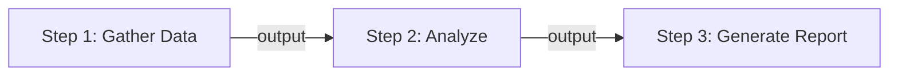
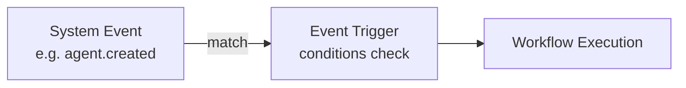
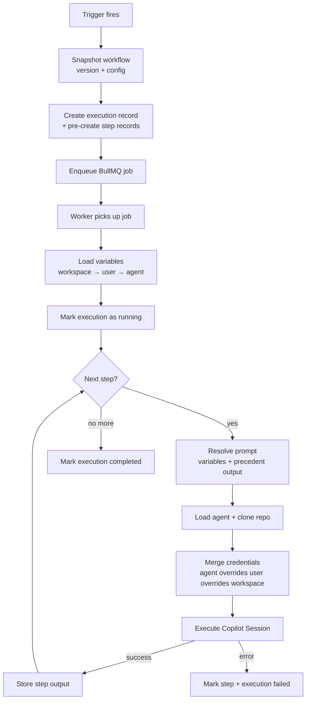
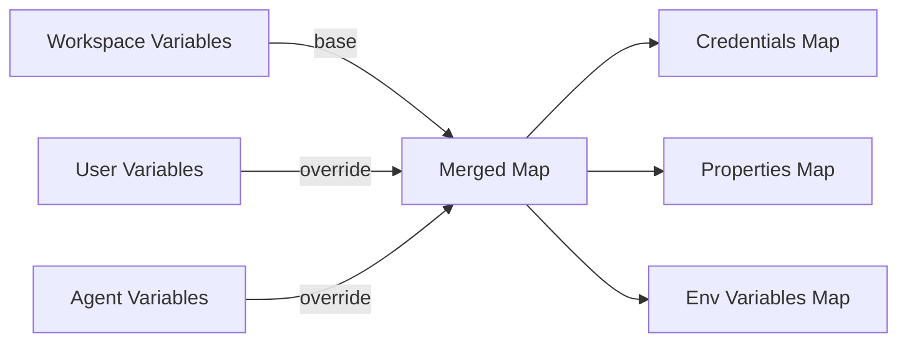
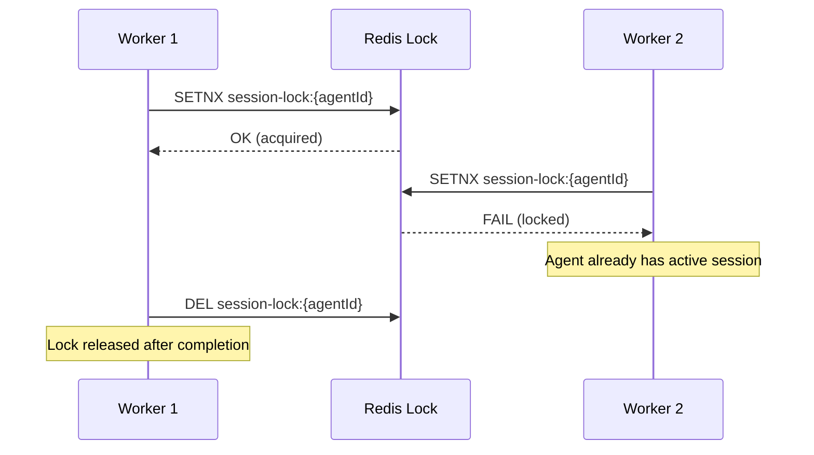
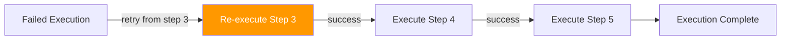
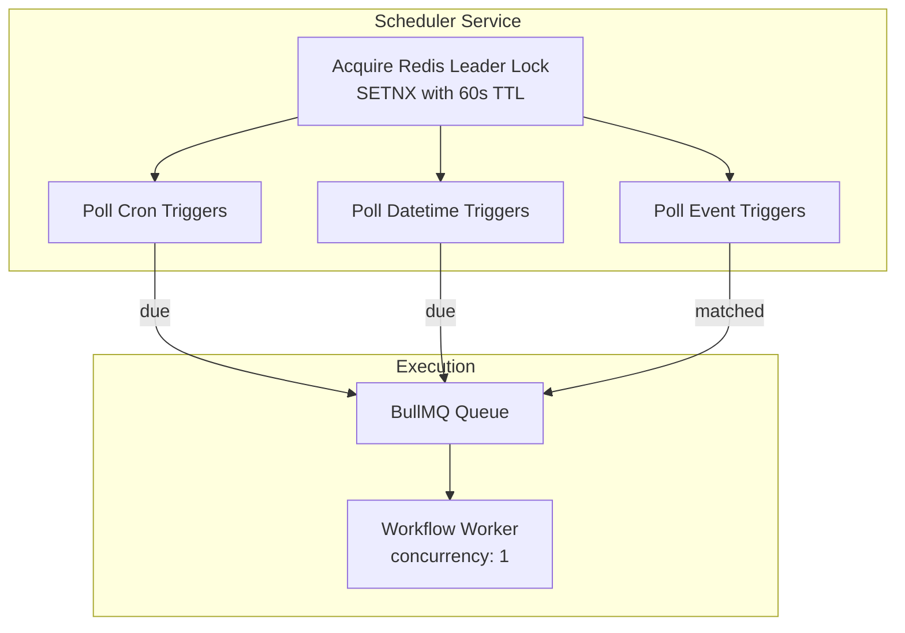

# Workflows

A **workflow** is an ordered sequence of steps, each executed as a separate Copilot session. Steps pass output forward, enabling complex multi-stage reasoning.

## Workflow Structure



Each workflow has:
- **Name & description**
- **Labels** — filterable tags for organizing workflows (e.g., `production`, `daily`, `reporting`)
- **Default agent** — used when a step doesn't specify its own
- **Default model** — selected from admin-configured models (e.g., `claude-sonnet-4-6`, `gpt-5.4`)
- **Default reasoning effort** — `high`, `medium`, or `low`
- **Scope** — `user` (private) or `workspace` (shared, admin-only creation)
- **Version** — auto-incremented on every edit

## Steps

Each step defines:

| Field | Description |
|---|---|
| **Name** | Human-readable step label |
| **Prompt Template** | The markdown prompt sent to the Copilot session |
| **Agent** | Optional override (defaults to workflow's agent) |
| **Model** | Optional override (defaults to workflow's model) |
| **Reasoning Effort** | Optional override (`high`, `medium`, `low`) |
| **Timeout** | Max execution time in seconds (30–3600, default: 300) |

### Resolution Priority

For Agent, Model, and Reasoning Effort, the engine resolves in this order:
1. **Step-level override** (if set)
2. **Workflow-level default** (if set)
3. **Platform default** (for model: `DEFAULT_AGENT_MODEL` env var, defaults to `gpt-4.1`)

### Jinja2 Prompt Templates

Prompt templates use **Jinja2 templating** (powered by Nunjucks). Available variables:

| Variable | Description |
|---|---|
| `{{ precedent_output }}` | Output from the previous step (or manual input for step 1) |
| `{{ properties.KEY }}` | Agent/user/workspace property values |
| `{{ credentials.KEY }}` | Agent/user/workspace credential values |
| `{{ env.KEY }}` | Variables marked for env injection |

**Backward compatibility:** The legacy `<PRECEDENT_OUTPUT>` and `{{ Properties.KEY }}` syntax is automatically converted to the new Jinja2 format.

You can use any Jinja2 features: conditionals, loops, filters, etc.

```markdown
Analyze the market for {{ properties.MARKET_SYMBOL }}.
Current risk limit: {{ properties.MAX_RISK_PERCENT }}


Previous analysis:
{{ precedent_output }}

```

### Example: 3-Step Workflow

**Step 1 — "Analyze Market":**
```markdown
Analyze the current market conditions for AAPL, GOOG, MSFT.
For each symbol, provide:
1. Current trend (bullish/bearish/neutral)
2. Key support/resistance levels
3. Recent news impact
```

**Step 2 — "Make Trade Decisions":**
```markdown
Based on the following market analysis, decide which trades to make:

{{ precedent_output }}

For each recommended trade, provide: symbol, side, quantity, and reasoning.
```

**Step 3 — "Write Blog Post":**
```markdown
Write a brief market commentary blog post based on the following trade decisions:

{{ precedent_output }}

Write in a professional but approachable tone.
```

## Triggers

Triggers define **when** a workflow executes. Every workflow supports manual execution; triggers add automation.

### Trigger Types

| Type | Description | Configuration |
|------|-------------|---------------|
| **Cron Schedule** | Recurring execution | Cron expression (e.g., `0 9 * * 1-5`) |
| **Exact Datetime** | One-shot at a specific time | ISO 8601 datetime (auto-deactivates after firing) |
| **Webhook** | External HTTP call | URL endpoint + HMAC-SHA256 secret |
| **Event** | React to system events | Event name + optional conditions |
| **Manual** | UI button click | Optional user input message |

### Cron Expression Examples

```
0 9 * * 1-5    → 9:00 AM every weekday
*/30 * * * *   → Every 30 minutes
0 0 1 * *      → First day of every month at midnight
```

### Event Trigger

React to system events with optional data matching:



**Available system events (21):**

| Category | Events |
|---|---|
| Agent | `agent.created`, `agent.updated`, `agent.deleted`, `agent.status_changed` |
| Workflow | `workflow.created`, `workflow.updated`, `workflow.deleted` |
| Execution | `execution.started`, `execution.completed`, `execution.failed`, `execution.cancelled` |
| Step | `step.completed`, `step.failed` |
| Trigger | `trigger.fired` |
| User | `user.login`, `user.registered` |
| Variable | `variable.created`, `variable.updated`, `variable.deleted` |
| Credential | `credential.access_requested`, `credential.access_approved`, `credential.access_denied` |

**Event data conditions** — filter by matching key-value pairs (e.g., `scope = workspace`, `agentName = "MyAgent"`).

### Webhook Security

- **HMAC-SHA256** signature verification
- **5-minute replay protection**
- **Event ID deduplication**

## Workflow Engine

The workflow engine orchestrates the execution of multi-step workflows, managing variable resolution, agent loading, Copilot session creation, and error recovery.

### Execution Pipeline



### Variable Resolution

Variables are resolved in three tiers with override semantics:



### Concurrency Control



Each agent can only have one active Copilot session at a time.

## Workflow Execution

A single run of a workflow:

- **Status flow** — `pending` → `running` → `completed` | `failed` | `cancelled`
- **Workflow Snapshot** — Complete snapshot of workflow + steps at trigger time (immutable)
- **Step Executions** — Ordered list of step execution records with output and reasoning trace

### Retry Mechanism

Failed executions can be retried **from the last failed step**:



When retrying:
- Steps before the failure are **preserved** (outputs remain)
- Precedent output for the retry step is recovered from the last completed step
- Execution continues normally from the retry point

### Error Handling

- If a step fails, the entire workflow execution is marked `failed`
- Remaining steps are marked `skipped`
- Error details are logged in `step_executions.error` and `workflow_executions.error`
- BullMQ handles job-level retries for transient failures (network, pod crash)

### Scheduler Architecture



- **30-second poll interval** for all trigger types
- **Redis leader lock** prevents duplicate execution in multi-replica setups
- **Cron triggers** — check `nextRunAt <= NOW()`
- **Datetime triggers** — fire once, then auto-deactivate
- **Event triggers** — match unprocessed system events against conditions

### Model Selection

Models are managed by workspace admins in **Admin → Models**. Default models:

| Model | Provider |
|---|---|
| `claude-sonnet-4-6` | Anthropic |
| `claude-opus-4-6` | Anthropic |
| `gpt-5.4` | OpenAI |
| `gpt-5-mini` | OpenAI |
