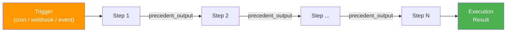
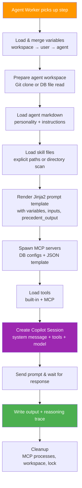
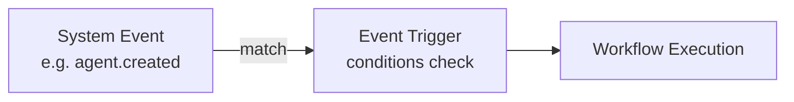

# Workflows

A **workflow** is an ordered sequence of steps, each executed as a separate Copilot session. Steps pass output forward, enabling complex multi-stage reasoning.

## Workflow Structure



A workflow is a linear pipeline of steps. Each step runs as an independent Copilot session. The output of step _N_ becomes <span v-pre>`{{ precedent_output }}`</span> for step _N+1_.

Each workflow has:
- **Name & description**
- **Labels** — filterable tags for organizing workflows (e.g., `production`, `daily`, `reporting`)
- **Default agent** — used when a step doesn't specify its own
- **Default model** — selected from admin-configured models (e.g., `claude-sonnet-4-6`, `gpt-5.4`)
- **Default reasoning effort** — `high`, `medium`, or `low`
- **Worker runtime** — workflow default for step dispatch: `static` (BullMQ worker pool) or `ephemeral` (one Kubernetes pod per step)
- **Step allocation timeout** — how long a step may remain pending while waiting for a runtime to become ready
- **Scope** — `user` (private) or `workspace` (shared, admin-only creation)
- **Version** — auto-incremented on every edit

## Version History

Workflows keep immutable version history for the workflow definition, ordered steps, and triggers.

- The latest editable page lives at `/{workspace}/workflows/:id`
- Historical snapshots live at `/{workspace}/workflows/:id/v/:version`
- Historical pages are read-only and are the target for execution detail links, so users can inspect the exact workflow version that produced an execution

Workflow history captures the state before each edit so older versions remain navigable even after later changes.

## Steps

Each step defines:

| Field | Description |
|---|---|
| **Name** | Human-readable step label |
| **Prompt Template** | The markdown prompt sent to the Copilot session |
| **Agent** | Optional override (defaults to workflow's agent) |
| **Model** | Optional override (defaults to workflow's model) |
| **Reasoning Effort** | Optional override (`high`, `medium`, `low`) |
| **Worker Runtime** | Optional override (`static`, `ephemeral`) that falls back to the workflow default |
| **Timeout** | Max execution time in seconds (30–3600, default: 300) |

### Resolution Priority

For Agent, Model, Reasoning Effort, and Worker Runtime, the engine resolves in this order:
1. **Step-level override** (if set)
2. **Workflow-level default** (if set)
3. **Platform default** (for model: `DEFAULT_AGENT_MODEL` env var, defaults to `gpt-4.1`; for runtime: `static`)

### Worker Runtime

Workflow dispatch resolves the runtime per step:

| Runtime | Behavior |
|---|---|
| **`static`** | Enqueue the step on the shared `agent-step-execution` BullMQ queue for long-running worker instances. The step stays `pending` until a static worker starts it. |
| **`ephemeral`** | Create a dedicated Kubernetes pod for that step. The step stays `pending` while the pod is created and becomes ready. |

The resolved runtime is snapshotted onto each `workflow_execution`, so execution history keeps the original dispatch mode even if the workflow is edited later.

### Step Allocation Timeout

Each workflow defines a **Step Allocation Timeout** in seconds.

- A **static** step uses this timeout while waiting for a shared worker to start the job.
- An **ephemeral** step uses this timeout while waiting for its dedicated pod to be created and reach a runnable state.
- While allocation is pending, the step remains `pending` and the workflow execution remains `running`.
- The workflow only fails when allocation exceeds the configured timeout.

### Jinja2 Prompt Templates

Prompt templates use **Jinja2 templating** (powered by Nunjucks). Available variables:

| Variable | Description |
|---|---|
| <span v-pre>`{{ precedent_output }}`</span> | Output from the previous step |
| <span v-pre>`{{ properties.KEY }}`</span> | Agent/user/workspace property values |
| <span v-pre>`{{ credentials.KEY }}`</span> | Agent/user/workspace credential values |
| <span v-pre>`{{ env.KEY }}`</span> | Variables marked for env injection |
| <span v-pre>`{{ inputs.KEY }}`</span> | Webhook parameter / manual run input values |

For the full template variable reference, see [Template Variables](/reference/template-variables).

You can use any Jinja2 features: conditionals, loops, filters, etc.

```markdown
Analyze the market for {{ properties.MARKET_SYMBOL }}.
Current risk limit: {{ properties.MAX_RISK_PERCENT }}


Previous analysis:
{{ precedent_output }}

```

### Example: 3-Step Workflow

**Step 1 — "Analyze Market":**
```markdown
Analyze the current market conditions for AAPL, GOOG, MSFT.
For each symbol, provide:
1. Current trend (bullish/bearish/neutral)
2. Key support/resistance levels
3. Recent news impact
```

**Step 2 — "Make Trade Decisions":**
```markdown
Based on the following market analysis, decide which trades to make:

{{ precedent_output }}

For each recommended trade, provide: symbol, side, quantity, and reasoning.
```

**Step 3 — "Write Blog Post":**
```markdown
Write a brief market commentary blog post based on the following trade decisions:

{{ precedent_output }}

Write in a professional but approachable tone.
```

## What Happens on the Agent

When a step is dispatched to an agent worker, the following pipeline runs inside the agent instance:



For full details on each phase, see [Agent Steps](/concepts/agent-steps).

## Triggers

Triggers define **when** a workflow executes. Workflows can also be run manually from the UI when a webhook trigger is configured.

### Trigger Types

| Type | Description | Configuration |
|------|-------------|---------------|
| **Cron Schedule** | Recurring execution | Cron expression (e.g., `0 9 * * 1-5`) |
| **Exact Datetime** | One-shot at a specific time | ISO 8601 datetime (auto-deactivates after firing) |
| **Webhook** | External HTTP call with parameter validation | URL path + HMAC-SHA256 secret + parameter definitions |
| **Event** | React to system events | Event name + optional conditions |

Triggers can be **edited in place**. Use `PUT /api/triggers/:id` (or the **Edit** button in the workflow UI) to update the trigger type, configuration, or enabled state. Webhook paths must still be unique across all webhook triggers.

### Manual Run

The **Manual Run** button in the UI allows authenticated users to trigger a workflow directly. It is available when the workflow has at least one active **webhook trigger**.

When clicked, the UI shows input fields based on the webhook trigger's **parameter definitions**. Required parameters must be filled in before the run starts. The inputs are available in prompt templates as <span v-pre>`{{ inputs.PARAM_NAME }}`</span>.

Manual Run calls `POST /api/workflows/:id/run`, which inserts a `webhook.received` event into the event system. The Controller picks it up in the next poll cycle and enqueues the execution.

### Webhook Parameters

Webhook triggers support **user-defined parameters**:

| Field | Description |
|---|---|
| **Name** | Parameter key (used in templates as <span v-pre>`{{ inputs.name }}`</span>) |
| **Required** | If `true`, the parameter must be provided (validated on webhook and manual run) |
| **Description** | Optional help text shown in the Manual Run dialog |

When a webhook fires (`POST /api/webhooks/:path`), the request body is validated against the parameter definitions. Only defined parameters are passed through as `inputs`.

### Webhook Security

- **HMAC-SHA256** signature verification
- **Personal Access Token** (PAT) with `webhook:trigger` scope
- **5-minute replay protection**
- **Event ID deduplication**

### Cron Expression Examples

```
0 9 * * 1-5    → 9:00 AM every weekday
*/30 * * * *   → Every 30 minutes
0 0 1 * *      → First day of every month at midnight
```

### Event Trigger

React to system events with optional data matching:



For the full list of system events, see the [Events Reference](/reference/events).

**Event data conditions** — filter by matching key-value pairs (e.g., `scope = workspace`, `agentName = "MyAgent"`).

## Engine & Execution

For details on the workflow engine, controller, execution pipeline, retry mechanism, and concurrency, see [Workflow Engine & Controller](/concepts/workflow-engine).

For what happens inside each step — Jinja2 templating, variable resolution, Git checkout, Copilot session setup, tool loading, and cleanup — see [Agent Steps](/concepts/agent-steps).
