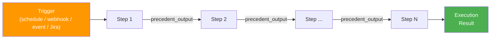
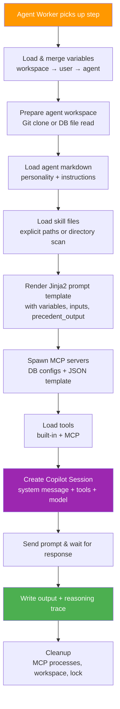
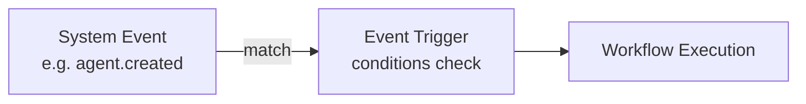

# Workflows

A **workflow** is an automation graph made of trigger blocks, agent-step blocks, and optional procedural blocks. Agent steps execute as separate Copilot sessions and can pass output to downstream blocks.

The workflow detail page uses three tabs: **Flows** for authoring (with Visual Editor and YAML Editor sub-tabs), **Executions** for run history, and **Variables**. The legacy block-step list has been replaced by the Visual Editor; existing sequential steps are shown as connected `agent_step` blocks so prompts and step overrides remain editable without switching modes.

## Flow Editing

Inside the **Flows** tab there are two complementary views over the same underlying graph:

- **Visual Editor** — drag-and-drop SVG canvas. Mouse-wheel zoom is anchored at the cursor (so the element under the pointer stays put). The toolbar also exposes a **Center** button next to **Reset** to fit and centre all blocks within the viewport.
- **YAML Editor** — the same workflow rendered as YAML (`blocks`, `edges`, `triggers`, `executionMode`). Edits are validated and saved back through the same `/api/workflow-graph/:id/graph` endpoint, so the two views are always in sync.

Example YAML:

```yaml
executionMode: graph
blocks:
  - key: start
    type: start
    name: Start
    position: { x: 40, y: 200 }
  - key: a
    type: agent_step
    name: A
    position: { x: 320, y: 200 }
    config: { promptTemplate: "Process {{ inputs.payload }}" }
edges:
  - { from: start, to: a }
triggers:
  - id: 7e3d…
    type: manual
    active: true
    configuration: {}
```

Fan-out (one block → multiple downstream blocks) executes children in parallel; fan-in (multiple parents → one child) waits for **all** upstream blocks to complete before running, when `executionMode` is `graph`.

## Workflow Structure



A workflow can still behave like a linear pipeline, but the authoring surface is visual. Each `agent_step` block runs as an independent Copilot session. The output of one agent step becomes <span v-pre>`{{ precedent_output }}`</span> for the next synced agent step, and graph-mode blocks can also use <span v-pre>`{{ node_input }}`</span> for the previous node output.

Each workflow has:
- **Name & description**
- **Labels** — filterable tags for organizing workflows (e.g., `production`, `daily`, `reporting`)
- **Default agent** — used when a step doesn't specify its own
- **Default model** — selected from admin-configured models (e.g., `claude-sonnet-4-6`, `gpt-5.4`)
- **Default reasoning effort** — `high`, `medium`, or `low`
- **Worker runtime** — workflow default for step dispatch: `static` (BullMQ worker pool) or `ephemeral` (one Kubernetes pod per step)
- **Step allocation timeout** — how long a step may remain pending while waiting for a runtime to become ready
- **Scope** — `user` (private) or `workspace` (shared, admin-only creation)
- **Version** — auto-incremented on every edit

## Version History

Workflows keep immutable version history for the workflow definition, ordered steps, and triggers.

- The latest editable page lives at `/{workspace}/workflows/:id`
- Historical snapshots live at `/{workspace}/workflows/:id/v/:version`
- Historical pages are read-only and are the target for execution detail links, so users can inspect the exact workflow version that produced an execution
- Direct navigation to a historical URL opens that dedicated read-only snapshot view rather than the latest editable workflow page

Workflow history captures the state before each edit so older versions remain navigable even after later changes.

Trigger create, update, and delete operations also increment the workflow version, whether they originate from the UI, the API, or built-in agent tools.

## Visual Editor

The **Visual Editor** tab is the primary workflow authoring surface. It represents every existing sequential workflow step as an `agent_step` block and lets users add, delete, position, and connect blocks directly on the canvas.

Clicking an agent-step block expands the inspector and exposes the same controls that used to live in the block-step editor: **Prompt Template**, agent override, model override, reasoning effort, worker runtime, timeout, and position. Clicking empty canvas space collapses the inspector. Drag empty canvas space to pan around large workflows.

Saved workflow triggers appear on the canvas as trigger elements connected to the first agent step, making the execution entry path visible. Trigger creation, editing, deletion, and connectivity tests now live inside the Visual Editor inspector rather than in a separate trigger tab.

Saving a graph switches the workflow to graph mode and synchronizes all `agent_step` blocks back into `workflow_steps` for version history and classic step-list compatibility. Procedural blocks such as HTTP requests, scripts, conditionals, parallel markers, and joins are stored only in the graph tables.

## Execution Detail View

Workflow execution detail pages summarize the run with styled metadata blocks for trigger source, workflow, runtime, start time, duration, and step progress.

Expanded step panels use a dark detail surface so logs, prompt text, reasoning output, and markdown previews remain readable. The selected step tab intentionally switches to a light active state for contrast, and markdown tables/code blocks are themed consistently across Output and Reasoning tabs.

## Steps

Each step defines:

| Field | Description |
|---|---|
| **Name** | Human-readable step label |
| **Prompt Template** | The markdown prompt sent to the Copilot session |
| **Agent** | Optional override (defaults to workflow's agent) |
| **Model** | Optional override (defaults to workflow's model) |
| **Reasoning Effort** | Optional override (`high`, `medium`, `low`) |
| **Worker Runtime** | Optional override (`static`, `ephemeral`) that falls back to the workflow default |
| **Timeout** | Max execution time in seconds (30–3600, default: 300) |

### Resolution Priority

For Agent, Model, Reasoning Effort, and Worker Runtime, the engine resolves in this order:
1. **Step-level override** (if set)
2. **Workflow-level default** (if set)
3. **Platform default** (for model: `DEFAULT_AGENT_MODEL` env var, defaults to `gpt-4.1`; for runtime: `static`)

### Worker Runtime

Workflow dispatch resolves the runtime per step:

| Runtime | Behavior |
|---|---|
| **`static`** | Enqueue the step on the shared `agent-step-execution` BullMQ queue for long-running worker instances. The step stays `pending` until a static worker starts it. |
| **`ephemeral`** | Create a dedicated Kubernetes pod for that step. The step stays `pending` while the pod is created and becomes ready. |

The resolved runtime is snapshotted onto each `workflow_execution`, so execution history keeps the original dispatch mode even if the workflow is edited later.

### Step Allocation Timeout

Each workflow defines a **Step Allocation Timeout** in seconds.

- A **static** step uses this timeout while waiting for a shared worker to start the job.
- An **ephemeral** step uses this timeout while waiting for its dedicated pod to be created and reach a runnable state.
- While allocation is pending, the step remains `pending` and the workflow execution remains `running`.
- The workflow only fails when allocation exceeds the configured timeout.

### Jinja2 Prompt Templates

Prompt templates use **Jinja2 templating** (powered by Nunjucks). Available variables:

| Variable | Description |
|---|---|
| <span v-pre>`{{ precedent_output }}`</span> | Output from the previous step |
| <span v-pre>`{{ properties.KEY }}`</span> | Agent/user/workspace property values |
| <span v-pre>`{{ credentials.KEY }}`</span> | Agent/user/workspace credential values |
| <span v-pre>`{{ env.KEY }}`</span> | Variables marked for env injection |
| <span v-pre>`{{ inputs.KEY }}`</span> | Webhook parameter / manual run input values |

For the full template variable reference, see [Template Variables](/reference/template-variables).

You can use any Jinja2 features: conditionals, loops, filters, etc.

```markdown
Analyze the market for {{ properties.MARKET_SYMBOL }}.
Current risk limit: {{ properties.MAX_RISK_PERCENT }}


Previous analysis:
{{ precedent_output }}

```

### Example: 3-Step Workflow

**Step 1 — "Analyze Market":**
```markdown
Analyze the current market conditions for AAPL, GOOG, MSFT.
For each symbol, provide:
1. Current trend (bullish/bearish/neutral)
2. Key support/resistance levels
3. Recent news impact
```

**Step 2 — "Make Trade Decisions":**
```markdown
Based on the following market analysis, decide which trades to make:

{{ precedent_output }}

For each recommended trade, provide: symbol, side, quantity, and reasoning.
```

**Step 3 — "Write Blog Post":**
```markdown
Write a brief market commentary blog post based on the following trade decisions:

{{ precedent_output }}

Write in a professional but approachable tone.
```

## What Happens on the Agent

When a step is dispatched to an agent worker, the following pipeline runs inside the agent instance:



For full details on each phase, see [Agent Steps](/concepts/agent-steps).

## Triggers

Triggers define **when** a workflow executes. Workflows can also be run manually from the UI when a webhook trigger is configured.

### Trigger Types

| Type | Description | Configuration |
|------|-------------|---------------|
| **Schedule** | Recurring execution | Cron expression (e.g., `0 9 * * 1-5`) |
| **Exact Datetime** | One-shot at a specific time | ISO 8601 datetime (auto-deactivates after firing) |
| **Webhook** | Trigger from user-provided inputs and reusable parameter definitions | Path + parameter definitions |
| **System Event** | React to platform events | Event name + optional scope + conditions |
| **Jira Changes Notification** | Register an Atlassian dynamic webhook filtered by JQL | Jira site URL + OAuth 2.0 credential references + JQL + Jira event list |
| **Jira Polling** | Poll Jira search results on an interval with overlap-window dedupe | Jira site URL + API token or OAuth 2.0 credential references + JQL + interval |

The workflow create and detail pages now use a **trigger catalog** plus an inline editor, so new trigger types can be added without changing the page layout. On the workflow detail page, the catalog opens from the right edge of the trigger tab, while editing an existing trigger converts that specific trigger card into the edit form instead of opening a second detached form.

Existing trigger cards also surface sanitized runtime summaries such as Jira registration state, webhook expiration, last sync time, or the last successful polling time.

Jira trigger credential references are selected from workflow-visible credential variables (workspace or user scope), not entered as free text.

Saved trigger cards expose a **Test Connectivity** action. For Jira notification triggers, the connectivity test verifies Jira webhook registration and probes the hosted callback URL. For Jira polling triggers, it executes the configured JQL with the saved credentials.

Triggers can be **edited in place**. Use `PUT /api/triggers/:id` (or the inline editor in the workflow UI) to update the trigger type, configuration, or enabled state. Webhook paths must still be unique across all webhook triggers.

### Manual Run

The **Manual Run** button in the UI allows authenticated users to trigger a workflow directly. It is available when the workflow has at least one active **webhook trigger**.

When clicked, the UI shows input fields based on the webhook trigger's **parameter definitions**. Required parameters must be filled in before the run starts. The inputs are available in prompt templates as <span v-pre>`{{ inputs.PARAM_NAME }}`</span>.

Manual Run calls `POST /api/workflows/:id/run`, which inserts a `webhook.received` event into the event system. The Controller picks it up in the next poll cycle and enqueues the execution.

Deleting a workflow removes its live trigger configuration and execution records while preserving trigger metadata already snapshotted onto execution rows. Trigger deletion clears execution `triggerId` references transactionally so recently accepted manual or webhook runs do not block cleanup.

### Webhook Parameters

Webhook triggers support **user-defined parameters**:

| Field | Description |
|---|---|
| **Name** | Parameter key (used in templates as <span v-pre>`{{ inputs.name }}`</span>) |
| **Required** | If `true`, the parameter must be provided (validated on webhook and manual run) |
| **Description** | Optional help text shown in the Manual Run dialog |

When a webhook fires (`POST /api/webhooks/:registrationId`), the request body is validated against the parameter definitions. Only defined parameters are passed through as `inputs`. The workflow trigger provisions and maintains that registration automatically behind the scenes.

### Webhook Security

- **HMAC-SHA256** signature verification
- **Personal Access Token** (PAT) with `webhook:trigger` scope
- **5-minute replay protection**
- **Event ID deduplication**

### Jira Changes Notification

Jira Changes Notification uses Atlassian dynamic webhooks instead of OAO polling the Jira REST API directly.

- `PUBLIC_API_BASE_URL` must point at the public OAO API origin because Jira must call back into `/api/jira-webhooks/:triggerId?token=...`
- Jira API tokens are **not** enough for dynamic webhook registration; this trigger requires Jira OAuth 2.0 credentials
- OAO refreshes Jira webhook registrations before they expire and dedupes repeated Atlassian delivery identifiers

### Jira Polling

Jira Polling is designed for cases where webhook registration is not available or not desired.

- Supports Jira API tokens or Jira OAuth 2.0 credentials
- Queries Jira search on the configured interval
- Uses an overlap window plus a recent-issue map so eventual consistency and controller restarts do not create obvious gaps or duplicate executions

### Cron Expression Examples

```
0 9 * * 1-5    → 9:00 AM every weekday
*/30 * * * *   → Every 30 minutes
0 0 1 * *      → First day of every month at midnight
```

### Event Trigger

React to system events with optional data matching:



For the full list of system events, see the [Events Reference](/reference/events).

**Event data conditions** — filter by matching key-value pairs (e.g., `scope = workspace`, `agentName = "MyAgent"`).

## Engine & Execution

For details on the workflow engine, controller, execution pipeline, retry mechanism, and concurrency, see [Workflow Engine & Controller](/concepts/workflow-engine).

For what happens inside each step — Jinja2 templating, variable resolution, Git checkout, Copilot session setup, tool loading, and cleanup — see [Agent Steps](/concepts/agent-steps).
