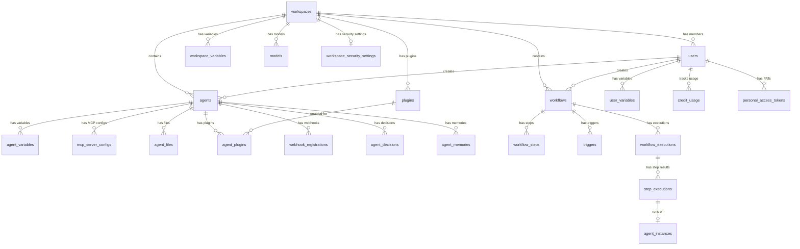

# Database Schema

PostgreSQL 16 with pgvector extension. All tables use UUID primary keys and timestamps with timezone. Managed via Drizzle ORM.

## Entity Relationship

## Enums

| Enum | Values |
|---|---|
| `user_role` | `super_admin`, `workspace_admin`, `creator_user`, `view_user` |
| `agent_status` | `active`, `paused`, `error` |
| `execution_status` | `pending`, `running`, `completed`, `failed`, `cancelled` |
| `step_status` | `pending`, `running`, `completed`, `failed`, `skipped` |
| `trigger_type` | `time_schedule`, `exact_datetime`, `webhook`, `event`, `manual` |
| `agent_source_type` | `github_repo`, `database` |
| `variable_type` | `property`, `credential` |
| `reasoning_effort` | `low`, `medium`, `high` |
| `resource_scope` | `user`, `workspace` |
| `event_scope` | `workspace`, `user` |
| `memory_type` | `observation`, `insight`, `strategy`, `lesson_learned`, `general` |
| `instance_type` | `static`, `ephemeral` |
| `instance_status` | `idle`, `busy`, `offline`, `terminated` |

## Security Features

- **Encryption** — All credential values encrypted with AES-256-GCM
- **Parameterized queries** — Drizzle ORM prevents SQL injection
- **UUID keys** — Non-guessable primary keys
- **Foreign keys** — Cascade deletes for referential integrity
- **Unique indexes** — Prevent duplicate variable keys per scope
- **Zero credential exposure** — Agents never access credentials directly. Credentials are injected via Jinja2 templates into MCP configs and HTTP headers. See [AI Security](/concepts/security)
- **Personal Access Tokens** — SHA-256 hashed, fine-grained scopes, optional expiry

## Table Reference

For full table definitions, see:

- [Core Tables](/database/schema-core) — Tenancy, Agents, Workflows, Executions
- [Support Tables](/database/schema-support) — Variables, Admin & Quota, Plugins, Audit & Memory, Auth & Tokens
