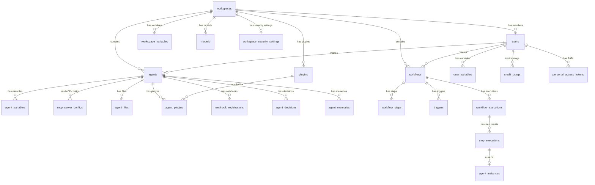

# Database Schema

PostgreSQL 16 with pgvector extension. All tables use UUID primary keys and timestamps with timezone. Managed via Drizzle ORM.

## Entity Relationship

## Enums

| Enum | Values |
|---|---|
| `user_role` | `super_admin`, `workspace_admin`, `creator_user`, `view_user` |
| `agent_status` | `active`, `paused`, `error` |
| `execution_status` | `pending`, `running`, `completed`, `failed`, `cancelled` |
| `step_status` | `pending`, `running`, `completed`, `failed`, `skipped` |
| `trigger_type` | `time_schedule`, `exact_datetime`, `webhook`, `event`, `manual` |
| `agent_source_type` | `github_repo`, `database` |
| `variable_type` | `property`, `credential` |
| `reasoning_effort` | `low`, `medium`, `high` |
| `resource_scope` | `user`, `workspace` |
| `event_scope` | `workspace`, `user` |
| `memory_type` | `observation`, `insight`, `strategy`, `lesson_learned`, `general` |
| `instance_type` | `static`, `ephemeral` |
| `instance_status` | `idle`, `busy`, `offline`, `terminated` |

## Tenancy Tables

### workspaces

Tenant isolation boundary. All entities reference a workspace.

| Column | Type | Notes |
|---|---|---|
| id | UUID PK | |
| name | varchar(200) | |
| slug | varchar(100) | Unique, URL-safe identifier |
| description | text | |
| isDefault | boolean | Default workspace cannot be deleted |
| createdAt, updatedAt | timestamp | |

### users

Independent auth (email/password/bcrypt).

| Column | Type | Notes |
|---|---|---|
| id | UUID PK | |
| workspaceId | UUID FK → workspaces | Cascade delete |
| email | varchar(255) | Unique |
| name | varchar(100) | |
| passwordHash | text | bcrypt |
| role | user_role | Default: `creator_user` |
| createdAt | timestamp | |

## Agent Tables

### agents

AI agent definitions.

| Column | Type | Notes |
|---|---|---|
| id | UUID PK | |
| workspaceId | UUID FK → workspaces | Cascade delete |
| userId | UUID | Owner user |
| name | varchar(100) | |
| description | text | |
| sourceType | agent_source_type | Default: `github_repo` |
| gitRepoUrl | varchar(500) | Required for `github_repo` |
| gitBranch | varchar(100) | Default: `main` |
| agentFilePath | varchar(300) | Path to .md in repo |
| skillsDirectory | varchar(500) | Skills directory path |
| skillsPaths | varchar(300)[] | Explicit skill file paths |
| githubTokenEncrypted | text | AES-256-GCM encrypted |
| githubTokenCredentialId | varchar(100) | References credential variable |
| builtinToolsEnabled | jsonb | Array of enabled built-in tool names |
| mcpJsonTemplate | text | Jinja2 template for mcp.json (rendered with variables before session) |
| scope | resource_scope | Default: `user`. Immutable |
| status | agent_status | |
| lastSessionAt | timestamp | |
| createdAt, updatedAt | timestamp | |

### agent_files

Database-stored agent files (for `sourceType: database`).

| Column | Type | Notes |
|---|---|---|
| id | UUID PK | |
| agentId | UUID FK → agents | Cascade delete |
| filePath | varchar(500) | Relative path (e.g., `agent.md`, `skills/research.md`) |
| content | text | Markdown content |
| createdAt, updatedAt | timestamp | |
| | | UNIQUE(agentId, filePath) |

### mcp_server_configs

MCP server configurations per agent.

| Column | Type | Notes |
|---|---|---|
| id | UUID PK | |
| agentId | UUID FK → agents | |
| name | varchar(100) | Display name |
| description | varchar(500) | |
| command | varchar(200) | Process command (`node`, `npx`, `python`) |
| args | jsonb | Command arguments array |
| envMapping | jsonb | Credential key → env var mapping |
| isEnabled | boolean | |
| writeTools | jsonb | Tool names requiring permission |
| createdAt, updatedAt | timestamp | |

## Workflow Tables

### workflows

Multi-step execution templates.

| Column | Type | Notes |
|---|---|---|
| id | UUID PK | |
| workspaceId | UUID FK → workspaces | Cascade delete |
| userId | UUID | Owner |
| name | varchar(200) | |
| description | text | |
| labels | varchar(50)[] | Filterable tags (GIN indexed) |
| isActive | boolean | |
| maxConcurrentExecutions | integer | Default: 1 |
| version | integer | Auto-incremented. Default: 1 |
| defaultAgentId | UUID FK → agents | Optional |
| defaultModel | varchar(100) | Optional |
| defaultReasoningEffort | reasoning_effort | Optional |
| scope | resource_scope | Default: `user`. Immutable |
| createdAt, updatedAt | timestamp | |

### workflow_steps

Ordered steps in a workflow.

| Column | Type | Notes |
|---|---|---|
| id | UUID PK | |
| workflowId | UUID FK → workflows | Cascade delete |
| name | varchar(200) | |
| promptTemplate | text | Markdown with optional `<PRECEDENT_OUTPUT>` |
| stepOrder | integer | 1-indexed |
| agentId | UUID FK → agents | Optional |
| model | varchar(100) | Optional override |
| reasoningEffort | reasoning_effort | Optional |
| timeoutSeconds | integer | Default: 300 |
| createdAt, updatedAt | timestamp | |
| | | UNIQUE(workflowId, stepOrder) |

### triggers

Trigger configurations for workflows.

| Column | Type | Notes |
|---|---|---|
| id | UUID PK | |
| workflowId | UUID FK → workflows | |
| triggerType | trigger_type | |
| configuration | jsonb | Type-specific config |
| isActive | boolean | |
| lastFiredAt | timestamp | |
| createdAt | timestamp | |

**Configuration JSONB examples:**
- **Cron**: `{ "cron": "0 9 * * 1-5", "timezone": "America/New_York" }`
- **Datetime**: `{ "datetime": "2025-01-15T09:00:00Z" }` (one-shot, auto-deactivates)
- **Webhook**: `{ "secret": "hmac-secret-encrypted" }`
- **Event**: `{ "eventName": "workflow.completed", "conditions": { "status": "completed" } }`

## Execution Tables

### workflow_executions

| Column | Type | Notes |
|---|---|---|
| id | UUID PK | |
| workflowId | UUID FK → workflows | |
| triggerId | UUID FK → triggers | |
| triggerMetadata | jsonb | Webhook payload, cron tick, retry info |
| workflowVersion | integer | Snapshot version at trigger time |
| workflowSnapshot | jsonb | Full workflow + steps snapshot (immutable) |
| status | execution_status | |
| currentStep | integer | 1-indexed |
| totalSteps | integer | |
| startedAt, completedAt | timestamp | |
| error | text | |
| createdAt | timestamp | |

### step_executions

| Column | Type | Notes |
|---|---|---|
| id | UUID PK | |
| workflowExecutionId | UUID FK → workflow_executions | |
| workflowStepId | UUID FK → workflow_steps | |
| stepOrder | integer | |
| resolvedPrompt | text | Prompt with variables replaced |
| output | text | Copilot session response |
| reasoningTrace | jsonb | Tool calls, intermediate thoughts |
| status | step_status | |
| startedAt, completedAt | timestamp | |
| error | text | |

## Variable Tables

All variable tables share the same structure: `key` (UPPER_SNAKE_CASE), `valueEncrypted` (AES-256-GCM), `variableType` (credential/property), `injectAsEnvVariable`.

### agent_variables

| Column | Type | Notes |
|---|---|---|
| id | UUID PK | |
| agentId | UUID FK → agents | |
| key | varchar(100) | UPPER_SNAKE_CASE |
| valueEncrypted | text | AES-256-GCM |
| description | varchar(300) | |
| variableType | variable_type | Default: `credential` |
| injectAsEnvVariable | boolean | |
| createdAt, updatedAt | timestamp | |
| | | UNIQUE(agentId, key) |

### user_variables

| Column | Type | Notes |
|---|---|---|
| id | UUID PK | |
| userId | UUID | |
| key | varchar(100) | |
| valueEncrypted | text | |
| description | varchar(300) | |
| variableType | variable_type | Default: `credential` |
| injectAsEnvVariable | boolean | |
| createdAt, updatedAt | timestamp | |
| | | UNIQUE(userId, key) |

### workspace_variables

| Column | Type | Notes |
|---|---|---|
| id | UUID PK | |
| workspaceId | UUID FK → workspaces | |
| key | varchar(100) | |
| valueEncrypted | text | |
| description | varchar(300) | |
| variableType | variable_type | Default: `credential` |
| injectAsEnvVariable | boolean | |
| createdAt, updatedAt | timestamp | |
| | | UNIQUE(workspaceId, key) |

## Admin & Quota Tables

### models

| Column | Type | Notes |
|---|---|---|
| id | UUID PK | |
| workspaceId | UUID FK → workspaces | |
| name | varchar(100) | UNIQUE per workspace |
| provider | varchar(50) | Default: `github` |
| description | text | |
| creditCost | decimal(10,2) | Default: 1.00 |
| isActive | boolean | |
| createdAt, updatedAt | timestamp | |

### workspace_quota_settings

| Column | Type | Notes |
|---|---|---|
| id | UUID PK | |
| workspaceId | UUID FK | UNIQUE |
| dailyCreditLimit | decimal(10,2) | Null = unlimited |
| monthlyCreditLimit | decimal(10,2) | Null = unlimited |
| updatedBy | UUID FK → users | |
| updatedAt | timestamp | |

### user_quota_settings

| Column | Type | Notes |
|---|---|---|
| id | UUID PK | |
| userId | UUID FK | UNIQUE |
| dailyCreditLimit | decimal(10,2) | Null = use workspace default |
| monthlyCreditLimit | decimal(10,2) | Null = use workspace default |
| updatedAt | timestamp | |

### credit_usage

| Column | Type | Notes |
|---|---|---|
| id | UUID PK | |
| workspaceId | UUID FK | |
| userId | UUID FK | |
| modelName | varchar(100) | |
| creditsConsumed | decimal(10,2) | Default: 0 |
| sessionCount | integer | |
| date | date | |
| createdAt | timestamp | |
| | | UNIQUE(userId, modelName, date) |

## Plugin Tables

### plugins

| Column | Type | Notes |
|---|---|---|
| id | UUID PK | |
| workspaceId | UUID FK → workspaces | |
| name | varchar(100) | |
| description | text | |
| gitRepoUrl | varchar(500) | |
| gitBranch | varchar(100) | Default: `main` |
| githubTokenEncrypted | text | AES-256-GCM |
| manifestCache | jsonb | Cached plugin.json |
| isAllowed | boolean | Admin toggle |
| createdBy | UUID FK → users | |
| createdAt, updatedAt | timestamp | |

### agent_plugins

| Column | Type | Notes |
|---|---|---|
| id | UUID PK | |
| agentId | UUID FK → agents | |
| pluginId | UUID FK → plugins | |
| isEnabled | boolean | Default: true |
| createdAt | timestamp | |
| | | UNIQUE(agentId, pluginId) |

## Audit & Memory Tables

### system_events

| Column | Type | Notes |
|---|---|---|
| id | UUID PK | |
| eventScope | enum(`workspace`, `user`) | |
| scopeId | UUID | workspaceId or userId |
| eventName | varchar(100) | One of 21 predefined events |
| eventData | jsonb | Event-specific payload |
| actorId | UUID | User who caused the event |
| createdAt | timestamp | Indexed for cursor-based polling |

### agent_decisions

| Column | Type | Notes |
|---|---|---|
| id | UUID PK | |
| agentId | UUID FK | |
| executionId | UUID FK | |
| category | varchar(50) | e.g., `trade`, `analysis` |
| action | varchar(50) | e.g., `buy`, `approve` |
| summary | text | |
| decision | jsonb | Full reasoning |
| outcome | varchar(20) | `executed`, `rejected`, `skipped` |
| referenceId | varchar(100) | External reference |
| createdAt | timestamp | |

### agent_memories

| Column | Type | Notes |
|---|---|---|
| id | UUID PK | |
| agentId | UUID FK | |
| content | text | Memory content |
| embedding | vector(1536) | pgvector embedding |
| metadata | jsonb | Additional context |
| createdAt | timestamp | |

### agent_instances

Tracks running agent instances (both static and ephemeral).

| Column | Type | Description |
|--------|------|-------------|
| id | UUID PK | |
| name | varchar(200) | Instance name (worker name or K8s pod name) |
| instance_type | enum | `static` or `ephemeral` |
| status | enum | `idle`, `busy`, `offline`, `terminated` |
| hostname | varchar(255) | Machine/container hostname |
| current_step_execution_id | UUID FK → step_executions | Currently executing step (nullable) |
| metadata | JSONB | Flexible metadata (pid, labels, etc.) |
| last_heartbeat_at | timestamp | Last heartbeat time |
| createdAt | timestamp | |
| updatedAt | timestamp | |

### webhook_registrations

| Column | Type | Notes |
|---|---|---|
| id | UUID PK | |
| agentId | UUID FK | |
| triggerId | UUID FK | |
| endpointPath | varchar(200) | URL path suffix |
| hmacSecretEncrypted | text | AES-256-GCM |
| isActive | boolean | |
| requestCount | integer | |
| lastReceivedAt | timestamp | |
| createdAt | timestamp | |

## Security Features

- **Encryption** — All credential values encrypted with AES-256-GCM
- **Parameterized queries** — Drizzle ORM prevents SQL injection
- **UUID keys** — Non-guessable primary keys
- **Foreign keys** — Cascade deletes for referential integrity
- **Unique indexes** — Prevent duplicate variable keys per scope
- **Zero credential exposure** — Agents never access credentials directly. Credentials are injected via Jinja2 templates into MCP configs and HTTP headers. See [AI Security](/concepts/security)
- **Personal Access Tokens** — SHA-256 hashed, fine-grained scopes, optional expiry

## Auth & Token Tables

### personal_access_tokens

Fine-grained PATs for webhook triggers and API access.

| Column | Type | Notes |
|---|---|---|
| id | UUID PK | |
| userId | UUID FK → users | Cascade delete |
| workspaceId | UUID FK → workspaces | Cascade delete |
| name | varchar(100) | User-friendly label |
| tokenHash | varchar(128) | SHA-256 hash (UNIQUE) |
| tokenPrefix | varchar(12) | First 8 chars for display (`oao_xxxx`) |
| scopes | jsonb | Array of granted scopes |
| expiresAt | timestamp | Null = no expiry |
| lastUsedAt | timestamp | Updated on each use |
| isRevoked | boolean | Default: false |
| createdAt | timestamp | |

**Available Scopes:**

| Scope | Description |
|---|---|
| `webhook:trigger` | Trigger webhook-type workflow triggers |
| `api:read` | Read-only API access (GET endpoints) |
| `api:write` | Write API access (POST/PUT/DELETE) |
| `api:agents` | Manage agents |
| `api:workflows` | Manage workflows |
| `api:executions` | View/manage executions |
| `api:variables` | Read/write variables |
| `api:triggers` | Manage triggers |
| `api:admin` | Admin operations |
