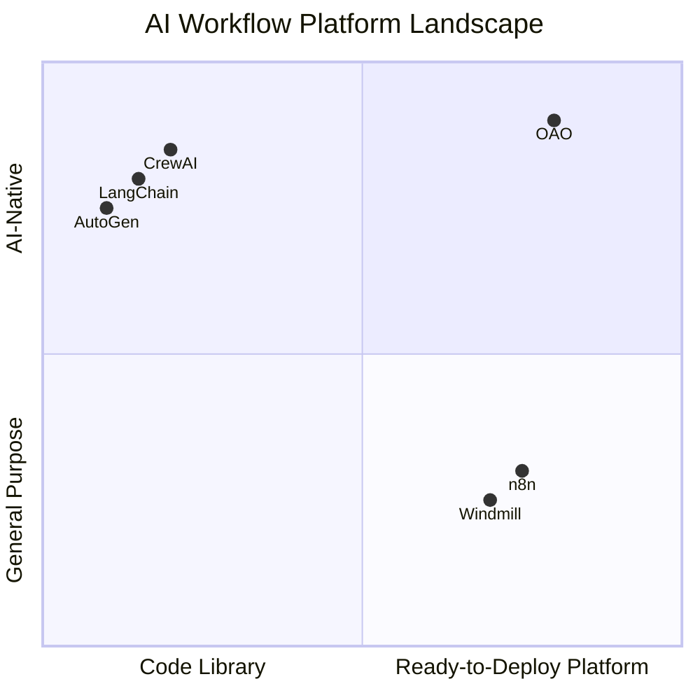

# Comparison with Other Platforms

How does Open Agent Orchestra compare with other AI workflow and agent orchestration platforms? This page provides an honest, feature-level comparison to help you decide if OAO fits your needs.

::: info Methodology
Comparisons are based on publicly documented features as of mid-2025. Every platform evolves rapidly — check their latest docs for updates. We focus on architectural differences, not subjective quality judgments.
:::

## Quick Comparison Matrix

| Capability | OAO | n8n | LangChain / LangGraph | CrewAI | AutoGen | Windmill |
|---|:---:|:---:|:---:|:---:|:---:|:---:|
| **Multi-step AI workflows** | ✅ | ✅ | ✅ | ✅ | ✅ | ✅ |
| **Visual workflow builder** | ✅ UI | ✅ UI | ❌ Code | ❌ Code | ❌ Code | ✅ UI |
| **AI-native (agents first)** | ✅ | ❌ | ✅ | ✅ | ✅ | ❌ |
| **Webhook triggers** | ✅ HMAC | ✅ | ❌ | ❌ | ❌ | ✅ |
| **Cron scheduling** | ✅ | ✅ | ❌ | ❌ | ❌ | ✅ |
| **Credential vault (encrypted at rest)** | ✅ AES-256 | ✅ | ❌ | ❌ | ❌ | ✅ |
| **Per-step agent/model selection** | ✅ | ❌ | ✅ | ✅ | ✅ | ❌ |
| **RBAC (multi-role)** | ✅ 4 roles | ✅ | ❌ | ❌ | ❌ | ✅ |
| **Multi-tenant workspaces** | ✅ | ✅ Enterprise | ❌ | ❌ | ❌ | ✅ |
| **MCP server support** | ✅ Native | ⚠️ Plugin | ⚠️ Integration | ❌ | ❌ | ❌ |
| **Cost quotas** | ✅ | ❌ | ❌ | ❌ | ❌ | ❌ |
| **Audit trail / events** | ✅ | ✅ | ❌ | ❌ | ❌ | ✅ |
| **SSE live streaming** | ✅ | ❌ | ✅ | ❌ | ❌ | ❌ |
| **Self-hosted** | ✅ | ✅ | ✅ | ✅ | ✅ | ✅ |
| **License** | MIT | Sustainable Use | MIT | MIT | MIT | AGPLv3 |
| **Primary language** | TypeScript | TypeScript | Python | Python | Python | TypeScript/Python |

## Detailed Comparisons

### OAO vs n8n

**n8n** is a popular workflow automation platform with 400+ integrations. It excels at connecting SaaS tools with visual flows.

| Dimension | OAO | n8n |
|---|---|---|
| **Focus** | AI agent orchestration | General-purpose workflow automation |
| **AI integration** | First-class: agents, per-step models, skills, prompt templates | AI is one node type among hundreds |
| **Agent model** | Git-hosted markdown instructions with skill files, MCP tools | LLM nodes with prompt fields |
| **Credential management** | 3-tier scoped (agent → user → workspace), AES-256-GCM | Per-credential, encrypted |
| **Cost controls** | Built-in daily/weekly/monthly quotas per user/workspace | Not available |
| **Architecture** | Hono + BullMQ + PostgreSQL/pgvector | Custom engine + PostgreSQL/SQLite |
| **Deployment** | Helm chart, single Docker image | Helm chart, Docker |

**Choose OAO when** you need AI-native workflows with agent segregation, cost controls, and MCP tool ecosystem integration.

**Choose n8n when** you need broad SaaS integrations (Salesforce, Airtable, Google Sheets, etc.) with AI as one component among many.

---

### OAO vs LangChain / LangGraph

**LangChain** is a Python framework for building LLM applications. **LangGraph** extends it with stateful, multi-actor workflows.

| Dimension | OAO | LangChain / LangGraph |
|---|---|---|
| **Type** | Platform (API + UI + engine) | Library (code framework) |
| **Setup** | Deploy and configure via UI | Write Python code, manage your own infra |
| **Triggers** | Webhooks, cron, events, manual (built-in) | Build your own trigger system |
| **Credentials** | Managed vault with encryption | Environment variables or custom |
| **Observability** | Built-in UI with live streaming, audit trail | LangSmith (separate paid service) |
| **Multi-tenancy** | Workspaces with RBAC | Not applicable |
| **Agent instructions** | Markdown files in Git repos | Python code/strings |

**Choose OAO when** you want a ready-to-deploy platform with built-in triggers, credential management, and a web UI — without writing Python infrastructure code.

**Choose LangChain when** you need maximum flexibility in agent architecture and are comfortable building and operating your own infrastructure.

---

### OAO vs CrewAI

**CrewAI** is a Python framework for orchestrating role-playing AI agents that collaborate on tasks.

| Dimension | OAO | CrewAI |
|---|---|---|
| **Type** | Platform with API + UI + scheduler | Python library |
| **Agent interaction** | Sequential steps with output chaining | Role-based collaboration (delegation) |
| **Deployment** | Kubernetes-ready with Helm | Embed in your Python app |
| **Triggers** | Cron, webhook, event, manual | Code-level invocation |
| **Credential management** | AES-256-GCM vault, 3-tier scoping | Not built-in |
| **RBAC** | 4 roles, workspace isolation | Not applicable |
| **Tool ecosystem** | MCP servers + built-in tools | LangChain tools, custom Python |

**Choose OAO when** you need a production platform with operational features (scheduling, webhooks, credentials, RBAC, cost tracking).

**Choose CrewAI when** you want a lightweight Python library for agent collaboration patterns and will build operational infrastructure yourself.

---

### OAO vs Microsoft AutoGen

**AutoGen** is Microsoft's framework for multi-agent conversation patterns.

| Dimension | OAO | AutoGen |
|---|---|---|
| **Type** | Deployment-ready platform | Research-oriented framework |
| **Focus** | Operational AI workflows (schedule, trigger, monitor) | Multi-agent conversation patterns |
| **UI** | Full dashboard (agents, workflows, executions, admin) | AutoGen Studio (experimental) |
| **Production features** | RBAC, quotas, audit trail, credential vault | Minimal |
| **Agent definition** | Git-hosted markdown + skills | Python classes |
| **Scheduling** | Built-in cron + triggers | External |

**Choose OAO when** you need a production-grade platform with enterprise operational controls.

**Choose AutoGen when** you're researching or prototyping complex multi-agent conversation patterns.

---

### OAO vs Windmill

**Windmill** is an open-source developer platform for building internal tools and workflows.

| Dimension | OAO | Windmill |
|---|---|---|
| **Focus** | AI agent orchestration | General-purpose scripts and workflows |
| **AI integration** | First-class: agents, models, skills, MCP | Scripts that call LLM APIs |
| **Agent model** | Dedicated agent concept with instructions + tools | Generic script execution |
| **Cost controls** | Per-user/workspace credit quotas | Not AI-specific |
| **License** | MIT | AGPLv3 (copyleft) |

**Choose OAO when** AI agent workflows are your primary use case and you want purpose-built AI tooling.

**Choose Windmill when** you need a general developer platform for scripts, cron jobs, and internal tools with AI as a secondary feature.

## Architectural Positioning

OAO occupies a unique position: it combines the **operational maturity** of workflow platforms (triggers, credentials, RBAC, quotas) with an **AI-native architecture** where agents are first-class citizens, not bolt-on integrations.

## Summary

| If you need... | Consider |
|---|---|
| AI-native workflow platform with enterprise controls | **OAO** |
| 400+ SaaS integrations with some AI | **n8n** |
| Maximum Python flexibility, build your own platform | **LangChain / LangGraph** |
| Lightweight Python agent collaboration library | **CrewAI** |
| Multi-agent conversation research | **AutoGen** |
| General-purpose script/workflow platform | **Windmill** |

::: tip Not mutually exclusive
OAO can call any REST API or MCP server as a tool. You can use LangChain-powered services as MCP servers that OAO agents call — combining the strengths of both platforms.
:::
