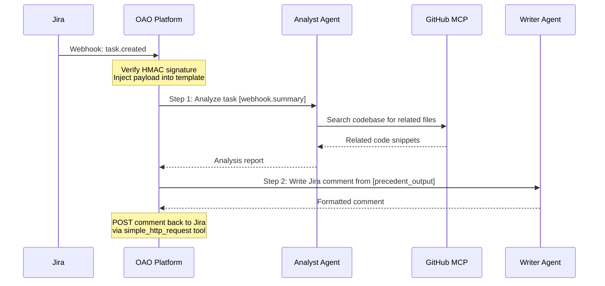
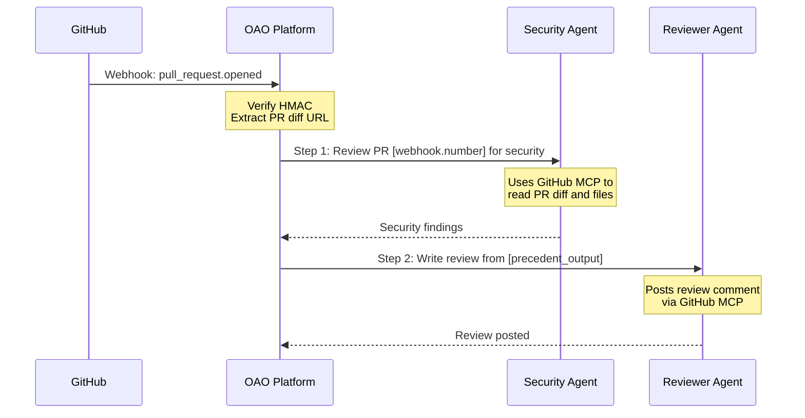
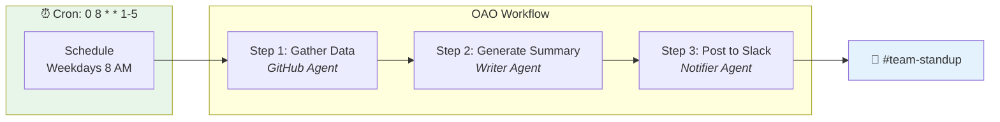
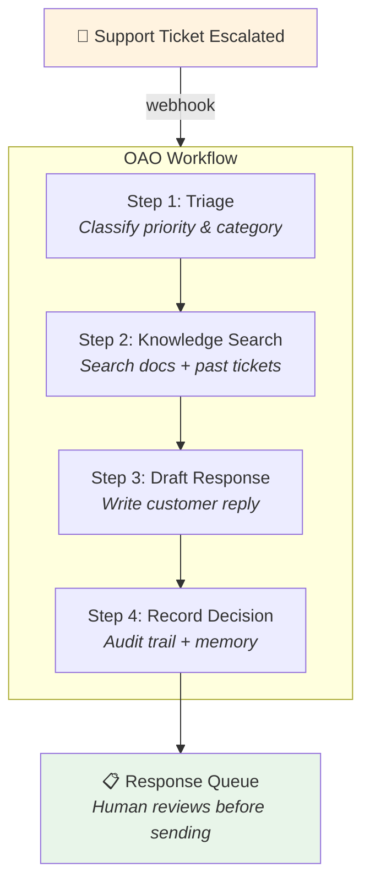
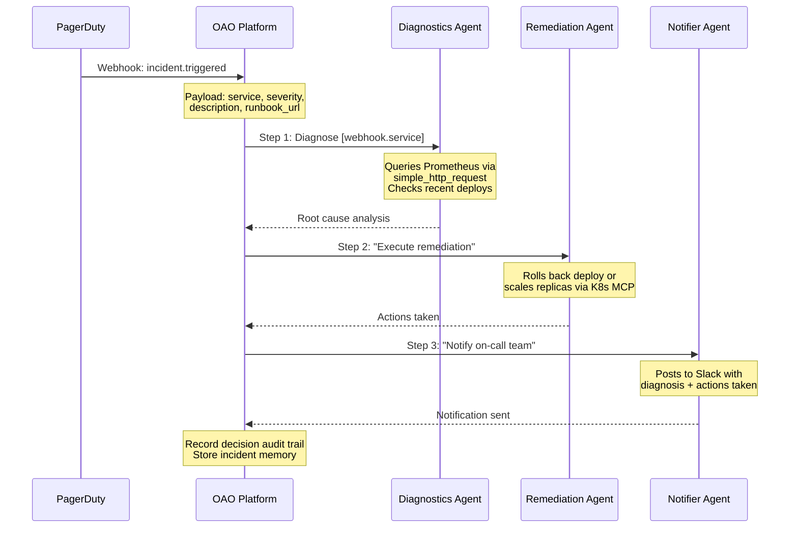
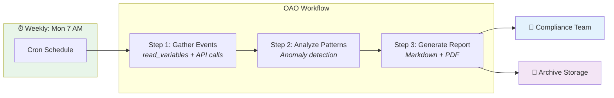
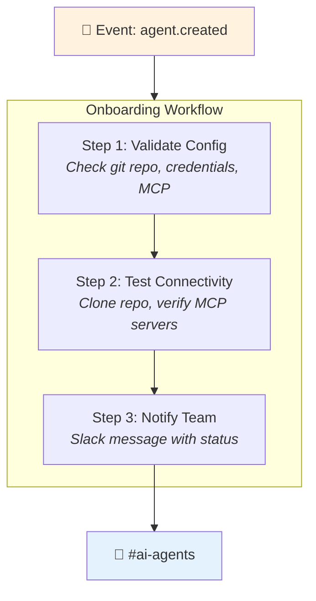

# Use Cases

Real-world scenarios showing how OAO connects AI agents to your existing workflows. Each example includes a conceptual architecture diagram, the trigger type, and the workflow steps involved.

## 1. Jira Task Assignment → AI Analysis & Response

**Scenario**: When a new Jira task is created and assigned to someone, an AI agent automatically analyzes the task, researches context from the codebase, and posts an initial analysis as a comment.

**Setup**:
- **Trigger**: `webhook` — Jira sends task-created events to OAO
- **Agent 1** (Analyst): GitHub MCP server for code search, read-only access
- **Agent 2** (Writer): `simple_http_request` tool to post comments back to Jira
- **Variables**: `JIRA_API_TOKEN` (agent-scoped credential), `JIRA_BASE_URL` (workspace property)

**Workflow Steps**:

| Step | Agent | Prompt Template |
|------|-------|----------------|

| 1 | Analyst | `Analyze this Jira task: "{{webhook.summary}}". Search the codebase for related files and identify the likely area of change. Task description: {{webhook.description}}` |
| 2 | Writer | `Based on this analysis: {{precedent_output}}. Write a concise Jira comment with: 1) affected files, 2) suggested approach, 3) estimated complexity. Post it to {{properties.JIRA_BASE_URL}}/rest/api/2/issue/{{webhook.issue_key}}/comment` |

---

## 2. GitHub PR Review Automation

**Scenario**: When a pull request is opened, an AI agent reviews the changes, checks for security issues, and posts a review summary.

**Setup**:
- **Trigger**: `webhook` — GitHub sends `pull_request.opened` events
- **Agent 1** (Security): GitHub MCP with read-only tools. Instructions focus on OWASP Top 10, credential leaks, SQL injection
- **Agent 2** (Reviewer): GitHub MCP with write tools (`create_review`). Instructions focus on code quality and constructive feedback
- **Benefit**: Segregation of duties — the security scanner can't post reviews, and the reviewer uses separate credentials

---

## 3. Daily Standup Report Generation

**Scenario**: Every weekday at 8 AM, OAO generates a team standup summary from yesterday's GitHub activity and posts it to Slack.

**Setup**:
- **Trigger**: `time_schedule` with `cronExpression: "0 8 * * 1-5"`
- **Variables**: `GITHUB_ORG` (workspace), `SLACK_WEBHOOK_URL` (workspace credential)
- **Three agents** with distinct responsibilities:
  1. **GitHub Agent**: Reads commits, PRs, and reviews from the last 24 hours
  2. **Writer Agent**: Summarizes activity into a human-friendly standup format
  3. **Notifier Agent**: Uses `simple_http_request` to post to Slack webhook

---

## 4. Customer Support Escalation

**Scenario**: An internal support tool sends a webhook when a ticket is escalated. OAO triages the ticket, searches the knowledge base, drafts a response, and logs the decision.

**Key Features Used**:
- **Webhook trigger** with parameters: `ticket_id`, `customer_name`, `subject`, `body`
- **Built-in tools**: `memory_retrieve` (find similar past tickets), `memory_store` (remember this resolution), `record_decision` (audit trail)
- **Human-in-the-loop**: The drafted response goes to a review queue — the agent doesn't send directly to the customer

---

## 5. Incident Response Runbook

**Scenario**: A monitoring system (PagerDuty, Prometheus Alertmanager) sends an alert webhook. OAO executes an automated runbook: check metrics, identify root cause, execute remediation steps, and notify the on-call team.

**Agent Segregation**:
- **Diagnostics Agent**: Read-only access to metrics APIs and deployment history
- **Remediation Agent**: Write access to Kubernetes (scale, rollback) — separate credentials, separate approval scope
- **Notifier Agent**: Only Slack webhook access — cannot modify infrastructure

This demonstrates **least-privilege access**: no single agent has full access to everything.

---

## 6. Scheduled Compliance Report

**Scenario**: Every Monday at 7 AM, generate a compliance report covering the past week's agent activity, credit usage, and security events.

**Built-in Tools Used**:
- `read_variables`: Access workspace-level configuration
- `simple_http_request`: Fetch data from internal APIs
- `record_decision`: Document the report generation decision
- `memory_store`: Archive key findings for trend analysis

---

## 7. Event-Driven Agent Onboarding

**Scenario**: When a new agent is created in OAO, an automated workflow validates its configuration, tests its connectivity, and notifies the team.

**Setup**:
- **Trigger**: `event` with `eventName: "agent.created"`
- This workflow is **triggered by OAO's own event system** — showcasing how the platform can orchestrate its own operations

---

## Patterns Summary

| Pattern | Trigger | Key Features |
|---------|---------|--------------|
| **Webhook → Analyze → Respond** | Webhook | HMAC auth, payload injection, multi-agent |
| **Schedule → Gather → Report** | Cron | Template variables, output chaining |
| **Alert → Diagnose → Fix → Notify** | Webhook | Agent segregation, least-privilege |
| **Event → Validate → Notify** | Event | Internal event bus, self-orchestration |

### Common Building Blocks

All use cases above leverage these OAO primitives:

- **Jinja2 Prompt Templates**: `{{webhook.field}}`, `{{precedent_output}}`, `{{properties.KEY}}`

- **3-Tier Variables**: Agent-scoped credentials, user preferences, workspace defaults
- **Agent Segregation**: Different agents per step with different tools and access levels
- **Built-in Tools**: `simple_http_request`, `memory_store/retrieve`, `record_decision`
- **MCP Servers**: GitHub, Kubernetes, Slack, or any custom MCP server

::: tip Build Your Own
These examples are starting points. OAO's composable architecture means you can mix and match triggers, agents, tools, and steps to build workflows tailored to your organization's needs.
:::
