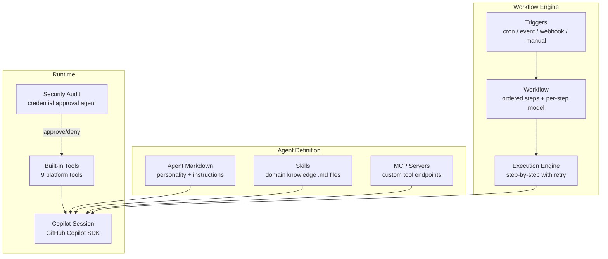

# What is Open Agent Orchestra?

**Open Agent Orchestra (OAO)** is an autonomous AI workflow engine powered by the [GitHub Copilot SDK](https://github.com/features/copilot). It lets you build **cost-effective AI teams** — define agents with different skills and cost levels, orchestrate them into multi-step workflows, and run them on schedule, via webhooks, or triggered by system events.

## The Problem

Many daily tasks can be broken down into multiple smaller tasks that are best solved by **different agents with different roles and skills**:

- A **lower-cost agent** does initial screening, data gathering, and triage
- A **higher-cost agent** with thinking capability and specific domain skills tackles the complex analysis
- A **specialized agent** handles reporting, notifications, or external integrations

This is exactly how a real team works — people with different capabilities collaborate on problems. We want an **AI team** that is:

- **Cost-effective** — Use expensive models only where their reasoning power is needed
- **Segregation of duties** — Each agent has a specific role with access only to what it needs
- **Secure** — Credentials are not freely available; every access is logged and can be audited
- **Auditable** — Full history of what each agent decided, which credentials it accessed, and why

### AI Security Challenge

When agents interact with external services, they need credentials (API keys, tokens, passwords). Traditional approaches expose credentials as environment variables — with no audit trail, no access control, and no way to know which agent used what and why.

**OAO solves this** with a **zero credential exposure** approach:
- Credentials are stored encrypted (AES-256-GCM) and resolved via Jinja2 templates (`{{ credentials.KEY }}`)
- Agents never see raw credentials — they are injected into MCP configs and HTTP headers server-side
- Scoped credentials (agent → user → workspace) provide fine-grained access control

### Beyond Just AI Security

Building production AI automation also requires solving infrastructure challenges:

- **Scheduling** — Running AI tasks on cron schedules or in response to events
- **Orchestration** — Chaining multiple AI steps where each builds on the previous output
- **Multi-tenancy** — Isolating agents, workflows, and data across teams
- **Error recovery** — Retrying from the failed step, not restarting the entire workflow
- **Tool integration** — Giving agents access to APIs, databases, and external services

## The Solution

OAO provides all of this as a single, self-hosted platform:

## Architecture at a Glance

| Component | Technology | Purpose |
|---|---|---|
| **OAO-API** | Hono v4.6, Node.js | REST API for agents, workflows, triggers, executions |
| **OAO-UI** | Nuxt 3, Vue 3, Tailwind | Dashboard for managing everything |
| **Database** | PostgreSQL 16 + pgvector | Persistent storage with vector embeddings |
| **Queue** | Redis 7 + BullMQ | Job queue for workflow execution |
| **Scheduler** | Custom Node.js service | Polls triggers every 30 seconds |
| **AI Engine** | GitHub Copilot SDK | Creates and manages Copilot sessions |
| **Deployment** | Docker + Helm + Kubernetes | Self-hosted, local or cloud |

## Who Is This For?

- **DevOps teams** automating recurring analysis and reporting with cost control
- **AI engineers** building multi-agent pipelines with different model tiers
- **Platform teams** providing AI automation as a shared service with proper security
- **Developers** who want agent orchestration without building infrastructure

## Next Steps

- [Host on Docker](/guide/docker) — Run OAO with Docker (no build required)
- [Host on Kubernetes](/guide/kubernetes) — Run OAO on Kubernetes with Helm
- [Build & Deploy](/guide/build-and-deploy) — Checkout source code and build from scratch
- [Agents & Tools](/concepts/agents) — Understand agents and the tool system
- [AI Security](/concepts/security) — Zero credential exposure with Jinja2 templates
