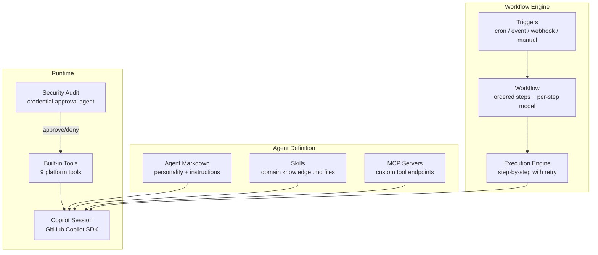

# What is Open Agent Orchestra?

**Open Agent Orchestra (OAO)** is an autonomous AI workflow engine powered by the [GitHub Copilot SDK](https://github.com/features/copilot). It lets you build **cost-effective AI teams** — define agents with different skills and cost levels, orchestrate them into multi-step workflows, and run them on schedule, via webhooks, or triggered by system events.

## The Problem

Many daily tasks can be broken down into multiple smaller tasks that are best solved by **different agents with different roles and skills**:

- A **lower-cost agent** does initial screening, data gathering, and triage
- A **higher-cost agent** with thinking capability and specific domain skills tackles the complex analysis
- A **specialized agent** handles reporting, notifications, or external integrations

This is exactly how a real team works — people with different capabilities collaborate on problems. We want an **AI team** that is:

- **Cost-effective** — Use expensive models only where their reasoning power is needed
- **Segregation of duties** — Each agent has a specific role with access only to what it needs
- **Secure** — Credentials are accessible in different scopes by tools and never allows agents to access directly
- **Auditable** — Full history of what each agent decided and tools were used

### AI Security Challenge

When agents interact with external services, they need credentials (API keys, tokens, passwords). Traditional approaches expose credentials as environment variables — with no access control and no way to scope which agent can use what.

**OAO solves this** with a **zero credential exposure** approach:
- Credentials are stored encrypted (AES-256-GCM) and resolved via Jinja2 templates (`{{ credentials.KEY }}`)
- Agents never see raw credentials — they are injected into MCP configs and HTTP headers server-side
- Scoped credentials (agent → user → workspace) provide fine-grained access control
- Agents can only access credentials through platform tools — direct access is not permitted

### Beyond Just AI Security

Building production AI automation also requires solving infrastructure challenges:

- **Scheduling** — Running AI tasks on cron schedules or in response to events
- **Orchestration** — Chaining multiple AI steps where each builds on the previous output
- **Multi-tenancy** — Isolating agents, workflows, and data across teams
- **Error recovery** — Retrying from the failed step, not restarting the entire workflow
- **Tool integration** — Giving agents access to APIs, databases, and external services

### Enterprise Needs

Organizations adopting AI automation at scale face additional requirements that OAO addresses:

- **Workspace isolation** — Each workspace provides a fully isolated boundary for administration, credentials, agents, and workflows. Teams share the same platform without risk of cross-tenant data leakage. Workspace admins manage their own users, rate limits, and secrets independently.

- **Prompt templating with variables** — Workflow steps use Jinja2 templates with user-defined variables (e.g., `{{ properties.REPORT_DATE }}`) and webhook payload data (e.g., `{{ inputs.issue_url }}`). This eliminates prompt duplication and enables operations teams to configure workflows without modifying agent code.

- **Request usage management** — Workspace defaults and user overrides support daily, weekly, and monthly credit limits. Usage is tracked per user, model, day, and stored credit-cost snapshot so historical totals remain stable even when model records change later.

- **Role-based access control (RBAC)** — Four roles (super_admin, workspace_admin, creator, viewer) control who can create agents, trigger workflows, manage credentials, and access admin functions. Fine-grained scopes on Personal Access Tokens restrict API access for integrations.

- **Agent decision audit trail** — Agents can record structured decisions via the built-in `record_decision` tool, creating a queryable trail of what was decided, why, and with what confidence. Combined with full step execution logs (including tool calls and reasoning traces), teams can reconstruct any agent's decision process.

- **Scalable execution architecture** — Each workflow selects a worker runtime: static workers for steady-state queue processing, or ephemeral Kubernetes instances for per-step isolation. This lets teams choose cost versus isolation per workflow.

## The Solution

OAO provides all of this as a single, self-hosted platform:

## Architecture at a Glance

| Component | Purpose |
|---|---|
| **OAO-API** | REST API for agents, workflows, triggers, executions |
| **OAO-UI** | Dashboard for managing everything |
| **OAO-Controller** | Polls triggers, dispatches workflows, provisions agent instances |
| **Agent Workers** | Execute workflow steps via Copilot sessions |
| **PostgreSQL** | Persistent storage with pgvector embeddings |
| **Redis + BullMQ** | Job queues for workflow and step execution |
| **GitHub Copilot SDK** | Creates and manages AI sessions |

All backend roles (API, Controller, Agent Worker) run from a single `oao-core` Docker image — the role is selected by the container command at runtime.

## Who Is This For?

- **DevOps teams** automating recurring analysis and reporting with cost control
- **AI engineers** building multi-agent pipelines with different model tiers
- **Platform teams** providing AI automation as a shared service with proper security
- **Developers** who want agent orchestration without building infrastructure

## Next Steps

- [Host on Docker](/guide/docker) — Run OAO with Docker (no build required)
- [Host on Kubernetes](/guide/kubernetes) — Run OAO on Kubernetes with Helm
- [Build & Deploy](/guide/build-and-deploy) — Checkout source code and build from scratch
- [Agents & Tools](/concepts/agents) — Understand agents and the tool system
- [AI Security](/concepts/security) — Zero credential exposure with Jinja2 templates
- [Auth Providers](/concepts/auth-providers) — Database + LDAP/Active Directory authentication
