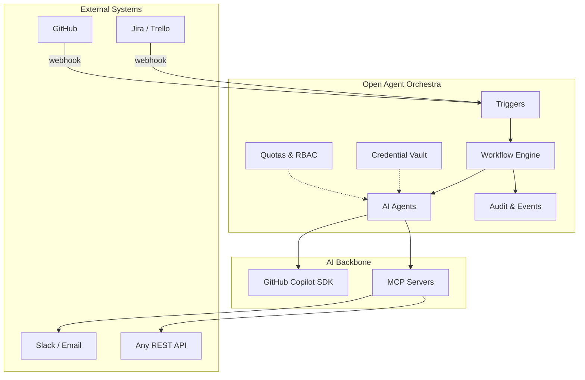

# Why Open Agent Orchestra?

AI is transforming software development, customer support, DevOps, and knowledge work. But most organizations hitting "AI adoption" face the same question:

> **How do we move from one-off AI chat sessions to production-grade, autonomous workflows that integrate with the systems we already use?**

## The Gap Between AI Demos and Production

Most AI tools today work well in isolation — a developer asks a question, an LLM answers. But enterprises need much more:

| What teams need | What most tools offer |
|---|---|
| AI agents embedded in existing workflows (Jira, GitHub, Slack, Trello) | Standalone chatbots |
| Multi-step pipelines that run autonomously on a schedule or webhook | One-shot prompt/response |
| Secure credential management across teams | Environment variables or plain text |
| Role-based access and audit trails for compliance | No governance |
| Cost controls and per-user/per-team quotas | Unlimited spend |
| Human-in-the-loop hybrid flows with approval gates | Fully autonomous or fully manual |

This is the **"last mile" problem** of enterprise AI adoption: bridging the gap between an impressive demo and a system your operations team can rely on.

## What OAO Solves

Open Agent Orchestra is a **workflow orchestration platform** purpose-built for AI agents. It provides the missing infrastructure between your AI models and your business processes.

### Key Capabilities

**1. Workflow Orchestration**

Define multi-step AI workflows where each step can use a different agent, model, or reasoning level. Steps execute in sequence with the output of one step feeding into the next via Jinja2 template variables. Workflows support cron schedules, one-time triggers, webhooks, and event-based triggers.

**2. Agent Segregation of Duties**

Each workflow step can use a different agent with different instructions, skills, and tool access. A "Read-Only Analyst" agent can gather data, while a "Writer" agent with different credentials creates the report. This mirrors enterprise security patterns: least-privilege access, separation of concerns.

**3. Secure Credential Management**

All secrets are encrypted at rest with AES-256-GCM. Variables follow a 3-tier scoping model (Agent → User → Workspace) so credentials can be shared across a team without exposing raw values. MCP server environment mappings inject credentials at runtime without ever writing them to disk in plaintext.

**4. Webhook Integration**

OAO accepts incoming webhooks from any system — Jira, GitHub, Trello, PagerDuty, custom apps — with HMAC-SHA256 signature verification, replay protection, and event deduplication. When a webhook fires, OAO injects the payload data into the workflow prompt template automatically.

**5. Cost Controls and Quotas**

Set daily, weekly, and monthly credit limits at the workspace and user level. Track usage by model, by agent, by day. Prevent runaway costs before they happen — not after the bill arrives.

**6. Role-Based Access Control**

Four roles (`super_admin`, `workspace_admin`, `creator_user`, `view_user`) control who can create agents, run workflows, manage credentials, or administer the platform. Supports database and LDAP authentication providers.

**7. Observability and Audit**

Every workflow execution records step-by-step output, reasoning traces (tool calls, intermediate results), live streaming via SSE, and system events. The event bus provides a full audit trail for compliance — who ran what, when, with which inputs, and what the AI decided.

## Who Is This For?

| Role | How OAO Helps |
|------|---------------|
| **Platform Engineers** | Deploy a self-hosted AI workflow engine with Helm on Kubernetes. No vendor lock-in, full control. |
| **DevOps / SRE Teams** | Automate incident triage, runbook execution, and reporting with scheduled + event-driven workflows. |
| **Engineering Managers** | Give developers AI agent access with guardrails — cost limits, audit trails, role-based permissions. |
| **Security & Compliance** | AES-256-GCM credential encryption, HMAC webhook auth, LDAP integration, full event audit trail. |
| **Product Teams** | Build AI-powered workflows that connect to Jira, GitHub, Slack — no custom infrastructure needed. |
| **AI/ML Engineers** | Configure agents with MCP servers, custom tools, and per-step model/reasoning selection. |

## The Copilot SDK Advantage

OAO is built on the **GitHub Copilot SDK** — the same infrastructure powering GitHub Copilot. This means:

- **Model-agnostic**: Use any model available through the Copilot model catalog (GPT-4o, Claude, etc.)
- **Tool ecosystem**: Native MCP (Model Context Protocol) support for connecting to thousands of existing tools
- **Enterprise-ready auth**: GitHub-based authentication with token management
- **Active development**: Backed by GitHub's investment in AI developer tools

## Open Source, Self-Hosted

OAO is MIT-licensed and designed for self-hosting. Your data stays on your infrastructure. Your credentials never leave your cluster. Your AI workflows run on your terms.

- **Docker Compose** for quick local development
- **Helm Charts** for production Kubernetes deployments
- **No cloud dependencies** — runs on Docker Desktop, Minikube, or any Kubernetes cluster

::: info Ready to get started?
Head to the [Docker setup guide](/guide/docker) or the [Kubernetes deployment guide](/guide/kubernetes) to run OAO in minutes.
:::
