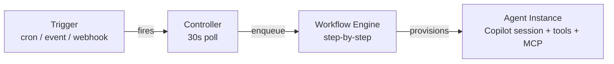

## Why Open Agent Orchestra?

Daily tasks can often be broken down into smaller subtasks that benefit from **different AI capabilities at different cost levels**. A lower-cost agent can screen and triage — then pass results to a higher-cost agent with specialized skills and reasoning power. **OAO** lets you build this kind of cost-effective AI team with proper credential management, audit trails, and segregation of duties.

### How It Works

### Key Differentiators

| Feature | OAO | Typical AI Frameworks |
|---|---|---|
| Cost-effective AI teams | Multi-agent workflows with per-step model selection | Single model for everything |
| Agent definition | Git-hosted markdown | Code-only |
| Credential security | Zero exposure — Jinja2 templates inject credentials into MCP configs & HTTP headers | Environment variables |
| Workflow orchestration | Built-in multi-step engine | Manual chaining |
| Scheduling | Cron, datetime, events, webhooks | External (cron jobs) |
| Multi-tenancy | Workspace isolation + RBAC | Single tenant |
| Tool ecosystem | Built-in tools + MCP + Plugins | Framework-specific |
| Execution history | Full audit trail per step | Logging only |
| Retry mechanism | Per-step retry from failure point | Full restart |
